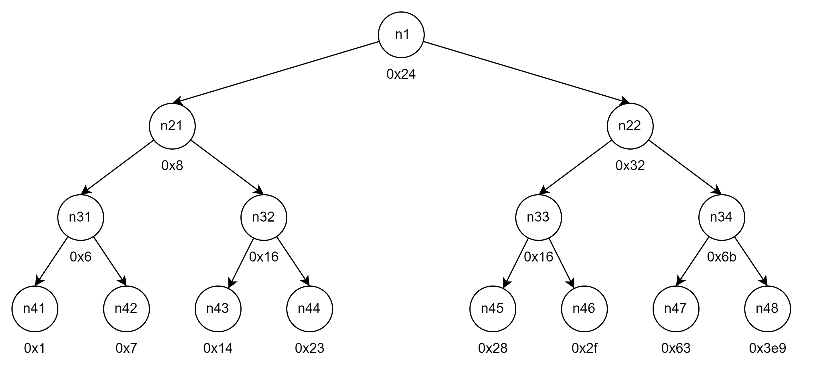

# Bomblab

> A "binary bomb" is a program provided to students as an **_object code file_**. When run, it prompts the user to type in 6 different strings. If any of these is incorrect, the bomb "explodes," printing an error message and logging the event on a grading server. Students must "defuse" their own unique bomb by **_disassembling_** and **_reverse engineering_** the program to determine what the 6 strings should be. The lab teaches students to understand assembly language, and also forces them to learn how to use a debugger. It's also great fun. A **_legendary lab_** among the CMU undergrads.

Bomblab 是 CSAPP 这门课程口碑最好的实验，并且也是最有趣的实验。Bomblab 主要给出两个文件：二进制 bomb 文件、bomb.c 源文件。有很多细节需要我们通过逆向工程分析。

注：在 [CSAPP 官网](https://csapp.cs.cmu.edu/3e/labs.html) 中，可以下载所有不含具体答案的 CSAPP 实验。

本文档包含两个部分：

1. Introduction 部分介绍了 Bomblab，该部分内容由 Bomblab 的实验手册中直接复制。
2. Solutions 部分具体分析了每个阶段的拆弹思路，并给出具体的分析过程以及每个阶段对应的 C 代码。

## Introduction

The nefarious _Dr. Evil_ has planted a slew of “binary bombs” on our class machines. A binary bomb is a program that consists of a sequence of phases. Each phase expects you to type a particular string on **stdin**. If you type the correct string, then the phase is _defused_ and the bomb proceeds to the next phase. Otherwise, the bomb _explodes_ by printing "BOOM!!!" and then terminating. The bomb is defused when every phase has been defused.

There are too many bombs for us to deal with, so we are giving each student a bomb to defuse. Your
mission, which you have no choice but to accept, is to defuse your bomb before the due date. Good luck,
and welcome to the bomb squad!

## Solutions⭐

由于 Bomblab 的逆向工程需要使用 GDB，在 resource/gdbnotes-x86-64.pdf 给出了常用的 GDB 指令作为参考。

首先，通过以下指令进入 GDB 调试：

```bash
gdb bomb
```

### Phase 1

运行反汇编指令，获取 Phase 1 对应的汇编代码：

```
(gdb) dias phase_1
Dump of assembler code for function phase_1:
   0x0000000000400ee0 <+0>:     sub    $0x8,%rsp
   0x0000000000400ee4 <+4>:     mov    $0x402400,%esi
   0x0000000000400ee9 <+9>:     call   0x401338 <strings_not_equal>
   0x0000000000400eee <+14>:    test   %eax,%eax
   0x0000000000400ef0 <+16>:    je     0x400ef7 <phase_1+23>
   0x0000000000400ef2 <+18>:    call   0x40143a <explode_bomb>
   0x0000000000400ef7 <+23>:    add    $0x8,%rsp
   0x0000000000400efb <+27>:    ret
End of assembler dump.
```

**分析**：Phase 1 首先调用了一个 `strings_not_equal` 函数，若该返回值为 0，则该阶段拆弹成功。通过函数的名称可以猜测到函数的功能，当输入的字符串 s 与内存地址 _0x402400_ 开始的字符串相等时，返回 0，否则返回 1。

运行以下指令，查看内存地址 _0x402400_ 开始的字符串：

```
(gdb) print (char *)0x402400
$1 = 0x402400 "Border relations with Canada have never been better."
```

因此 **Phase 1 的答案为**：`"Border relations with Canada have never been better."`。测试通过：

```
(gdb) run
Welcome to my fiendish little bomb. You have 6 phases with
which to blow yourself up. Have a nice day!
Border relations with Canada have never been better.
Phase 1 defused. How about the next one?
```

Phase 1 对应的 C 语言代码为：

```c
void phase_1(char *s)
{
    char *target = "Border relations with Canada have never been better.";
    if (string_not_equal(s, target))
        explode_bomb();
}
```

### Phase 2

运行反汇编指令，获取 Phase 2 对应的汇编代码：

```
(gdb) disas phase_2
Dump of assembler code for function phase_2:
   0x0000000000400efc <+0>:     push   %rbp
   0x0000000000400efd <+1>:     push   %rbx
   0x0000000000400efe <+2>:     sub    $0x28,%rsp
   0x0000000000400f02 <+6>:     mov    %rsp,%rsi
   0x0000000000400f05 <+9>:     call   0x40145c <read_six_numbers>
   0x0000000000400f0a <+14>:    cmpl   $0x1,(%rsp)
   0x0000000000400f0e <+18>:    je     0x400f30 <phase_2+52>
   0x0000000000400f10 <+20>:    call   0x40143a <explode_bomb>
   0x0000000000400f15 <+25>:    jmp    0x400f30 <phase_2+52>
   0x0000000000400f17 <+27>:    mov    -0x4(%rbx),%eax
   0x0000000000400f1a <+30>:    add    %eax,%eax
   0x0000000000400f1c <+32>:    cmp    %eax,(%rbx)
   0x0000000000400f1e <+34>:    je     0x400f25 <phase_2+41>
   0x0000000000400f20 <+36>:    call   0x40143a <explode_bomb>
   0x0000000000400f25 <+41>:    add    $0x4,%rbx
   0x0000000000400f29 <+45>:    cmp    %rbp,%rbx
   0x0000000000400f2c <+48>:    jne    0x400f17 <phase_2+27>
   0x0000000000400f2e <+50>:    jmp    0x400f3c <phase_2+64>
   0x0000000000400f30 <+52>:    lea    0x4(%rsp),%rbx
   0x0000000000400f35 <+57>:    lea    0x18(%rsp),%rbp
   0x0000000000400f3a <+62>:    jmp    0x400f17 <phase_2+27>
   0x0000000000400f3c <+64>:    add    $0x28,%rsp
   0x0000000000400f40 <+68>:    pop    %rbx
   0x0000000000400f41 <+69>:    pop    %rbp
   0x0000000000400f42 <+70>:    ret
End of assembler dump.
```

**分析**：首先，Phase 2 在栈上为局部变量（数组）分配空间，并调用 `read_six_numbers` 读入 6 个整数。若第 1 个整数不等于 1，炸弹将会引爆。

```
call   0x40145c <read_six_numbers>
cmpl   $0x1,(%rsp)
je     0x400f30 <phase_2+52>
call   0x40143a <explode_bomb>
```

因此我们得出**第 1 个整数为 1**。

当输入的第 1 个整数为 1 时，接着会执行下列指令，实际上为**循环的初始化**：

```
lea    0x4(%rsp),%rbx
lea    0x18(%rsp),%rbp
jmp    0x400f17 <phase_2+27>
```

初始化后，寄存器 %rbx、%rbp 分别指向第 2、第 6 个整数的内存地址。

循环对应的汇编代码如下：

```
mov    -0x4(%rbx),%eax
add    %eax,%eax
cmp    %eax,(%rbx)
je     0x400f25 <phase_2+41>
call   0x40143a <explode_bomb>
add    $0x4,%rbx
cmp    %rbp,%rbx
jne    0x400f17 <phase_2+27>
jmp    0x400f3c <phase_2+64>
```

这个循环用于**检测第 n 个整数是否为第 n - 1 个整数的两倍**，若不是，则炸弹将被引爆，由于我们已经确定第 1 个整数为 1，因此后续的 5 个整数分别为：2、4、8、16、32。

综上所述，Phase 2 的答案为：`1 2 4 8 16 32`。测试通过：

```
Phase 1 defused. How about the next one?
1 2 4 8 16 32
That's number 2.  Keep going!
```

Phase 2 对应的 C 语言代码为：

```c
#define SIZE 6
void phase_2()
{
    int i;
    int nums[SIZE];
    read_six_numbers(nums);

    if (nums[0] != 0)
        explode_bomb();

    for (i = 1; i < SIZE; i++)
        if (nums[i] != 2 * nums[i - 1])
            explode_bomb();
}
```

### Phase 3

运行反汇编指令，获取 Phase 3 对应的汇编代码：

```
(gdb) disas phase_3
Dump of assembler code for function phase_3:
   0x0000000000400f43 <+0>:     sub    $0x18,%rsp
   0x0000000000400f47 <+4>:     lea    0xc(%rsp),%rcx
   0x0000000000400f4c <+9>:     lea    0x8(%rsp),%rdx
   0x0000000000400f51 <+14>:    mov    $0x4025cf,%esi
   0x0000000000400f56 <+19>:    mov    $0x0,%eax
   0x0000000000400f5b <+24>:    call   0x400bf0 <__isoc99_sscanf@plt>
   0x0000000000400f60 <+29>:    cmp    $0x1,%eax
   0x0000000000400f63 <+32>:    jg     0x400f6a <phase_3+39>
   0x0000000000400f65 <+34>:    call   0x40143a <explode_bomb>
   0x0000000000400f6a <+39>:    cmpl   $0x7,0x8(%rsp)
   0x0000000000400f6f <+44>:    ja     0x400fad <phase_3+106>
   0x0000000000400f71 <+46>:    mov    0x8(%rsp),%eax
   0x0000000000400f75 <+50>:    jmp    *0x402470(,%rax,8)
   0x0000000000400f7c <+57>:    mov    $0xcf,%eax
   0x0000000000400f81 <+62>:    jmp    0x400fbe <phase_3+123>
   0x0000000000400f83 <+64>:    mov    $0x2c3,%eax
   0x0000000000400f88 <+69>:    jmp    0x400fbe <phase_3+123>
   0x0000000000400f8a <+71>:    mov    $0x100,%eax
   0x0000000000400f8f <+76>:    jmp    0x400fbe <phase_3+123>
   0x0000000000400f91 <+78>:    mov    $0x185,%eax
   0x0000000000400f96 <+83>:    jmp    0x400fbe <phase_3+123>
   0x0000000000400f98 <+85>:    mov    $0xce,%eax
   0x0000000000400f9d <+90>:    jmp    0x400fbe <phase_3+123>
   0x0000000000400f9f <+92>:    mov    $0x2aa,%eax
   0x0000000000400fa4 <+97>:    jmp    0x400fbe <phase_3+123>
   0x0000000000400fa6 <+99>:    mov    $0x147,%eax
   0x0000000000400fab <+104>:   jmp    0x400fbe <phase_3+123>
   0x0000000000400fad <+106>:   call   0x40143a <explode_bomb>
   0x0000000000400fb2 <+111>:   mov    $0x0,%eax
   0x0000000000400fb7 <+116>:   jmp    0x400fbe <phase_3+123>
   0x0000000000400fb9 <+118>:   mov    $0x137,%eax
   0x0000000000400fbe <+123>:   cmp    0xc(%rsp),%eax
   0x0000000000400fc2 <+127>:   je     0x400fc9 <phase_3+134>
   0x0000000000400fc4 <+129>:   call   0x40143a <explode_bomb>
   0x0000000000400fc9 <+134>:   add    $0x18,%rsp
   0x0000000000400fcd <+138>:   ret
End of assembler dump.
```

**分析**：首先，Phase 3 在栈上分配局部变量，随后调用库函数进行输入。

```
sub    $0x18,%rsp
lea    0xc(%rsp),%rcx
lea    0x8(%rsp),%rdx
mov    $0x4025cf,%esi
mov    $0x0,%eax
call   0x400bf0 <__isoc99_sscanf@plt>
cmp    $0x1,%eax
jg     0x400f6a <phase_3+39>
call   0x40143a <explode_bomb>
```

运行以下指令，查看内存地址 _0x4025cf_ 的字符串内容：

```
(gdb) print (char *)0x4025cf
$2 = 0x4025cf "%d %d"
```

其实就是 C 语言的 [sscanf 函数](https://cplusplus.com/reference/cstdio/sscanf/)的输入格式串，实际上需要我们输入两个整数 x、y，**若输入的整数个数小于 2，炸弹将会被引爆**。


若输入的整数个数大于或等于 2，则会执行下列指令，**若第 1 个整数大于 7，则炸弹将会引爆**。

```
cmpl   $0x7,0x8(%rsp)
ja     0x400fad <phase_3+106>
...
call   0x40143a <explode_bomb> # phase_3+106
```

若炸弹未被引爆，则执行下列的指令，明显是一个 switch 语句，根据输入的第一个整数作为根据，进行跳转，其中**跳转表**（Jump Table）的存放于 _0x402470_，根据下列代码，不难看出跳转表中共有 8 个 case。

```
mov    0x8(%rsp),%eax
jmp    *0x402470(,%rax,8)
mov    $0xcf,%eax
jmp    0x400fbe <phase_3+123>
mov    $0x2c3,%eax
jmp    0x400fbe <phase_3+123>
mov    $0x100,%eax
jmp    0x400fbe <phase_3+123>
mov    $0x185,%eax
jmp    0x400fbe <phase_3+123>
mov    $0xce,%eax
jmp    0x400fbe <phase_3+123>
mov    $0x2aa,%eax
jmp    0x400fbe <phase_3+123>
mov    $0x147,%eax
jmp    0x400fbe <phase_3+123>
call   0x40143a <explode_bomb>
mov    $0x0,%eax
jmp    0x400fbe <phase_3+123>
mov    $0x137,%eax
cmp    0xc(%rsp),%eax
je     0x400fc9 <phase_3+134>
call   0x40143a <explode_bomb>
add    $0x18,%rsp
ret
```

运行以下指令，查看跳转表的 8 个地址：

```
(gdb) x/8g 0x402470
0x402470:       0x0000000000400f7c      0x0000000000400fb9
0x402480:       0x0000000000400f83      0x0000000000400f8a
0x402490:       0x0000000000400f91      0x0000000000400f98
0x4024a0:       0x0000000000400f9f      0x0000000000400fa6
```

分析 switch 语句可知，其逻辑就是根据第一个输入的整数 x(0 <= x <= 7) 来匹配第二个整数，两个整数具有对应关系，结合跳转表以及 switch 语句对应的汇编代码可得 Phase 3 的答案如下表所示（**任意一行均可**）：
| x | y |
| --- | --- |
| 0 | 207 |
| 1 | 311 |
| 2 | 707 |
| 3 | 256 |
| 4 | 389 |
| 5 | 206 |
| 6 | 682 |
| 7 | 327 |

注：上述答案均通过 Phase 3 的测试。

Phase 3 对应的 C 语言代码如下：

```c
void phase_3()
{
    int x, y, n;
    if (scanf("%d %d", &x, &y) < 2)
        explode_bomb();

    switch (x)
    {
        case 0:
            if (y != 207) explode_bomb();
            break;
        case 1:
            if (y != 311) explode_bomb();
            break;
        case 2:
            if (y != 707) explode_bomb();
            break;
        case 3:
            if (y != 256) explode_bomb();
            break;
        case 4:
            if (y != 389) explode_bomb();
            break;
        case 5:
            if (y != 206) explode_bomb();
            break;
        case 6:
            if (y != 682) explode_bomb();
            break;
        case 7:
            if (y != 327) explode_bomb();
            break;
        default:
            explode_bomb();
    }
}
```

### Phase 4

运行反汇编指令，获取 Phase 4 对应的汇编代码：

```
(gdb) disas phase_4
   0x000000000040100c <+0>:     sub    $0x18,%rsp
   0x0000000000401010 <+4>:     lea    0xc(%rsp),%rcx
   0x0000000000401015 <+9>:     lea    0x8(%rsp),%rdx
   0x000000000040101a <+14>:    mov    $0x4025cf,%esi
   0x000000000040101f <+19>:    mov    $0x0,%eax
   0x0000000000401024 <+24>:    call   0x400bf0 <__isoc99_sscanf@plt>
   0x0000000000401029 <+29>:    cmp    $0x2,%eax
   0x000000000040102c <+32>:    jne    0x401035 <phase_4+41>
   0x000000000040102e <+34>:    cmpl   $0xe,0x8(%rsp)
   0x0000000000401033 <+39>:    jbe    0x40103a <phase_4+46>
   0x0000000000401035 <+41>:    call   0x40143a <explode_bomb>
   0x000000000040103a <+46>:    mov    $0xe,%edx
   0x000000000040103f <+51>:    mov    $0x0,%esi
   0x0000000000401044 <+56>:    mov    0x8(%rsp),%edi
   0x0000000000401048 <+60>:    call   0x400fce <func4>
   0x000000000040104d <+65>:    test   %eax,%eax
   0x000000000040104f <+67>:    jne    0x401058 <phase_4+76>
   0x0000000000401051 <+69>:    cmpl   $0x0,0xc(%rsp)
   0x0000000000401056 <+74>:    je     0x40105d <phase_4+81>
   0x0000000000401058 <+76>:    call   0x40143a <explode_bomb>
   0x000000000040105d <+81>:    add    $0x18,%rsp
   0x0000000000401061 <+85>:    ret
End of assembler dump.
```

首先，Phase 4 在栈上分配局部变量，与 Phase 3 汇编代码的开始部分是一样的，分析以下代码可知，我们**需要输入两个整数 x、y**，否则炸弹将会被引爆。

```
sub    $0x18,%rsp
lea    0xc(%rsp),%rcx
lea    0x8(%rsp),%rdx
mov    $0x4025cf,%esi
mov    $0x0,%eax
call   0x400bf0 <__isoc99_sscanf@plt>
cmp    $0x2,%eax
jne    0x401035 <phase_4+41>
...
call   0x40143a <explode_bomb> # <phase_4+41>
```

如果我们输入了两个整数，则会继续执行以下代码，**要求第一个整数 x 小于或等于 14**，否则炸弹将会被引爆。

```
cmpl   $0xe,0x8(%rsp)
jbe    0x40103a <phase_4+46>
call   0x40143a <explode_bomb>
```

随后调用函数 `func4(x, 0, 14)`。若 func4 的返回值不为 0 或者**第二个输入整数 y 不等于 0**，则炸弹那将会被引爆。因此，这里我们得到**第二个输入整数 y 等于 0**。

```
mov    $0xe,%edx # <phase_4+46>
mov    $0x0,%esi
mov    0x8(%rsp),%edi
call   0x400fce <func4>
test   %eax,%eax
jne    0x401058 <phase_4+76>
cmpl   $0x0,0xc(%rsp)
je     0x40105d <phase_4+81>
call   0x40143a <explode_bomb> # <phase_4+76>
```

下面开始分析函数 func4 的反汇编代码：

```
(gdb) disas func4
Dump of assembler code for function func4:
   0x0000000000400fce <+0>:     sub    $0x8,%rsp
   0x0000000000400fd2 <+4>:     mov    %edx,%eax
   0x0000000000400fd4 <+6>:     sub    %esi,%eax
   0x0000000000400fd6 <+8>:     mov    %eax,%ecx
   0x0000000000400fd8 <+10>:    shr    $0x1f,%ecx
   0x0000000000400fdb <+13>:    add    %ecx,%eax
   0x0000000000400fdd <+15>:    sar    %eax
   0x0000000000400fdf <+17>:    lea    (%rax,%rsi,1),%ecx
   0x0000000000400fe2 <+20>:    cmp    %edi,%ecx
   0x0000000000400fe4 <+22>:    jle    0x400ff2 <func4+36>
   0x0000000000400fe6 <+24>:    lea    -0x1(%rcx),%edx
   0x0000000000400fe9 <+27>:    call   0x400fce <func4>
   0x0000000000400fee <+32>:    add    %eax,%eax
   0x0000000000400ff0 <+34>:    jmp    0x401007 <func4+57>
   0x0000000000400ff2 <+36>:    mov    $0x0,%eax
   0x0000000000400ff7 <+41>:    cmp    %edi,%ecx
   0x0000000000400ff9 <+43>:    jge    0x401007 <func4+57>
   0x0000000000400ffb <+45>:    lea    0x1(%rcx),%esi
   0x0000000000400ffe <+48>:    call   0x400fce <func4>
   0x0000000000401003 <+53>:    lea    0x1(%rax,%rax,1),%eax
   0x0000000000401007 <+57>:    add    $0x8,%rsp
   0x000000000040100b <+61>:    ret
End of assembler dump.
```

函数 func4 是一个**递归函数**，因为 func4 会调用自身。我们假设函数 func4 的函数声明如下：

```c
int func4(int x, int y, int z);
```

func4 开头的几条指令用于计算表达式：`temp = y + (z - y) / 2`：

```
mov    %edx,%eax
sub    %esi,%eax
mov    %eax,%ecx
shr    $0x1f,%ecx
add    %ecx,%eax
sar    %eax
lea    (%rax,%rsi,1),%ecx
```

接着 func4 执行以下代码，该部分代码功能为：

- 若 temp > x，则调用函数 `func4(x, y, temp - 1)`。
- 若 x < temp，则调用函数 `func4(x, temp + 1, z)`。
- 若 x = temp，函数返回 0。

由此可见，函数 func4 的功能类似于 **二分查找**（Binary Search），但 func4 还做了一些额外处理。

```
cmp    %edi,%ecx
jle    0x400ff2 <func4+36>
lea    -0x1(%rcx),%edx
call   0x400fce <func4>
add    %eax,%eax
jmp    0x401007 <func4+57>
mov    $0x0,%eax # <func4+36>
cmp    %edi,%ecx
jge    0x401007 <func4+57>
lea    0x1(%rcx),%esi
call   0x400fce <func4>
lea    0x1(%rax,%rax,1),%eax
add    $0x8,%rsp # <func4+57>
ret
```

得到 **func4 对应的 C 语言代码**：

```c
int func4(int target, int lo, int hi)
{
    int mid = lo + (hi - lo) / 2;
    if (mid == target)
        return 0;
    else if (mid > target)
        return 2 * func4(target, lo, mid - 1);
    else if (mid < target)
        return 2 * func4(target, mid + 1, hi) + 1;
}
```

在 Phase 4 中，我们希望函数 `func4(x, 0, 14)` 的返回值为 0，因此我们在运行 func4 进行二分查找时，要么目标值 x 为对应折半查找树的树根，要么查找过程中一直走左子树，这样才能使 func4 的返回值为 0，可以得到输入 x 与 `func4(x, 0, 14)` 的**映射关系**：
| x | `func4(x, 0, 14)` |
| --- | --- |
| 0 | 0 |
| 1 | 0 |
| 2 | 4 |
| 3 | 0 |
| 4 | 2 |
| 5 | 2 |
| 6 | 6 |
| 7 | 0 |
| 8 | 1 |
| 9 | 1 |
| 10 | 5 |
| 11 | 1 |
| 12 | 3 |
| 13 | 3 |
| 14 | 7 |

因此，Phase 4 共有 4 个答案，分别为：**(0, 0)、(1, 0)、(3, 0)、(7, 0)**。

注：上述答案均通过测试，实际输入时两个整数以空格分隔。

### Phase 5
运行反汇编指令，获取 Phase 5 的汇编代码：
```
(gdb) disas phase_5
Dump of assembler code for function phase_5:
   0x0000000000401062 <+0>:     push   %rbx
   0x0000000000401063 <+1>:     sub    $0x20,%rsp
   0x0000000000401067 <+5>:     mov    %rdi,%rbx
   0x000000000040106a <+8>:     mov    %fs:0x28,%rax
   0x0000000000401073 <+17>:    mov    %rax,0x18(%rsp)
   0x0000000000401078 <+22>:    xor    %eax,%eax
   0x000000000040107a <+24>:    call   0x40131b <string_length>
   0x000000000040107f <+29>:    cmp    $0x6,%eax
   0x0000000000401082 <+32>:    je     0x4010d2 <phase_5+112>
   0x0000000000401084 <+34>:    call   0x40143a <explode_bomb>
   0x0000000000401089 <+39>:    jmp    0x4010d2 <phase_5+112>
   0x000000000040108b <+41>:    movzbl (%rbx,%rax,1),%ecx
   0x000000000040108f <+45>:    mov    %cl,(%rsp)
   0x0000000000401092 <+48>:    mov    (%rsp),%rdx
   0x0000000000401096 <+52>:    and    $0xf,%edx
   0x0000000000401099 <+55>:    movzbl 0x4024b0(%rdx),%edx
   0x00000000004010a0 <+62>:    mov    %dl,0x10(%rsp,%rax,1)
   0x00000000004010a4 <+66>:    add    $0x1,%rax
   0x00000000004010a8 <+70>:    cmp    $0x6,%rax
   0x00000000004010ac <+74>:    jne    0x40108b <phase_5+41>
   0x00000000004010ae <+76>:    movb   $0x0,0x16(%rsp)
   0x00000000004010b3 <+81>:    mov    $0x40245e,%esi
   0x00000000004010b8 <+86>:    lea    0x10(%rsp),%rdi
   0x00000000004010bd <+91>:    call   0x401338 <strings_not_equal>
   0x00000000004010c2 <+96>:    test   %eax,%eax
   0x00000000004010c4 <+98>:    je     0x4010d9 <phase_5+119>
   0x00000000004010c6 <+100>:   call   0x40143a <explode_bomb>
   0x00000000004010cb <+105>:   nopl   0x0(%rax,%rax,1)
   0x00000000004010d0 <+110>:   jmp    0x4010d9 <phase_5+119>
   0x00000000004010d2 <+112>:   mov    $0x0,%eax
   0x00000000004010d7 <+117>:   jmp    0x40108b <phase_5+41>
   0x00000000004010d9 <+119>:   mov    0x18(%rsp),%rax
   0x00000000004010de <+124>:   xor    %fs:0x28,%rax
   0x00000000004010e7 <+133>:   je     0x4010ee <phase_5+140>
   0x00000000004010e9 <+135>:   call   0x400b30 <__stack_chk_fail@plt>
   0x00000000004010ee <+140>:   add    $0x20,%rsp
   0x00000000004010f2 <+144>:   pop    %rbx
   0x00000000004010f3 <+145>:   ret    
End of assembler dump.
```
首先，我们分析 Phase 5 开头和结尾的代码，忽略中间的代码细节，首先在栈上分配空间，仔细观察该部分代码可知，使用了**栈破坏者检测机制**，通过判断金丝雀值（Canary）是否改变，判断是否发生**缓冲区溢出**。
```
push   %rbx
sub    $0x20,%rsp
mov    %rdi,%rbx
mov    %fs:0x28,%rax
mov    %rax,0x18(%rsp)
...
mov    0x18(%rsp),%rax
xor    %fs:0x28,%rax
je     0x4010ee <phase_5+140>
call   0x400b30 <__stack_chk_fail@plt>
add    $0x20,%rsp
pop    %rbx
ret    
```
然后，Phase 5 调用 `string_length()` 函数计算**输入字符串**的长度，若长度不为 6，则炸弹将会引爆，因此，Phase 5 要求我们**输入的字符串长度为 6**。

注：我们**输入的字符串的首地址存放在寄存器 rbx 中**，一开始也存放于寄存器 rdi 中。
```
xor    %eax,%eax
call   0x40131b <string_length>
cmp    $0x6,%eax
je     0x4010d2 <phase_5+112>
call   0x40143a <explode_bomb>
```
然后，将会执行一个循环，这里的循环计数器为寄存器 %rax，循环次数为 6，实际上，**该循环会生成一个字符串，生成的字符串的内容与我们输入的字符串相关**。
```
movzbl (%rbx,%rax,1),%ecx # <phase_5+41>
mov    %cl,(%rsp)
mov    (%rsp),%rdx
and    $0xf,%edx
movzbl 0x4024b0(%rdx),%edx
mov    %dl,0x10(%rsp,%rax,1)
add    $0x1,%rax
cmp    $0x6,%rax
jne    0x40108b <phase_5+41>
movb   $0x0,0x16(%rsp)
...
mov    $0x0,%eax
jmp    0x40108b <phase_5+41> # <phase_5+112>
```
上面省略号中的代码如下，该部分的功能为检测上面循环生成的字符串内存地址 *0x40245e* 的字符串是否相等，若不相等，炸弹将会被引爆。
```
mov    $0x40245e,%esi
lea    0x10(%rsp),%rdi
call   0x401338 <strings_not_equal>
test   %eax,%eax
je     0x4010d9 <phase_5+119>
call   0x40143a <explode_bomb>
nopl   0x0(%rax,%rax,1)
jmp    0x4010d9 <phase_5+119>
```
运行以下指令，查看位于内存地址 *0x40245e* 的目标字符串：
```
(gdb) print (char *)0x40245e
$4 = 0x40245e "flyers"
```
因此，我们需要在循环中生成字符串 `"flyers"`。仔细分析循环代码：
```
movzbl (%rbx,%rax,1),%ecx # <phase_5+41>
mov    %cl,(%rsp)
mov    (%rsp),%rdx
and    $0xf,%edx
movzbl 0x4024b0(%rdx),%edx
mov    %dl,0x10(%rsp,%rax,1)
add    $0x1,%rax
cmp    $0x6,%rax
jne    0x40108b <phase_5+41>
```
注意核心的两条指令，用于生成一个字符，循环的前半部分是**生成一个索引**（index），再根据一个位于内存地址 *0x4024b0* 的字符串，通过索引获取对应的字符，并存放于栈上。

注：寄存器 %rbx 存放着我们输入的字符串的首地址，内存地址 R[%rsp]+16 作为循环生成的字符串的首地址。
```
movzbl 0x4024b0(%rdx),%edx
mov    %dl,0x10(%rsp,%rax,1)
```
通过以下指令，获取位于内存地址 *0x4024b0* 的**连续 16 个字符**：
```
x/16c 0x4024b0
0x4024b0 <array.3449>:  109 'm' 97 'a'  100 'd' 117 'u' 105 'i' 101 'e' 114 'r' 115 's'
0x4024b8 <array.3449+8>:        110 'n' 102 'f' 111 'o' 116 't' 118 'v' 98 'b'  121 'y' 108 'l'
```
索引值与引用的字符关系如下表所示：
| 索引 | 引用字符 |
| --- | --- |
| 0 | m |
| 1 | a |
| 2 | d |
| 3 | u |
| 4 | i |
| 5 | e |
| 6 | r |
| 7 | s |
| 8 | n |
| 9 | f |
| 10 | o |
| 11 | t |
| 12 | v |
| 13 | b |
| 14 | y |
| 15 | l |

只需要查看 16 个字符，是因为索引最后与掩码 `0xf` 进行了与（and）运算，只保留低 4 位作为索引，索引生成的逻辑类似于 C 语句 `index = s[i] & 0xf`。其中 s 为输入的字符串。为了生成字符串 `"flyers"`，我们需要的**索引顺序为：9->15->14->5->6->7**，16 进制表示为：**0x9->0xf->0xe->0x5->0x6->0x7**。因此我们得到 Phase 5 共有两个答案，分别为：`"IONEFG"`、`"ionefg"`（ASCII 码的低 4 位的顺序均为索引顺序）。

注：上述答案均通过测试。

Phase 5 对应的 C 语言代码为：
```c
char tab[16] = { 'm', 'a', 'd', 'u', 'i', 'e', 'r', 's', 'n', 'f', 'o', 't', 'v', 'b', 'y', 'l'};
void phase_5(char *s)
{
    int i, index;
    char t[10];

    if (string_length(s) != 6)
        explode_bomb();
    
    for (i = 0; i < 6; i++)
    {
        index = s[i] & 0xf;
        t[i] = tab[index];
    }
    t[6] = '\0';
    
    if (string_not_equal(s, t))
        explode_bomb();
}
```

### Phase 6
运行反汇编指令，获取 Phase 6 的汇编代码：
```
Dump of assembler code for function phase_6:
   0x00000000004010f4 <+0>:     push   %r14
   0x00000000004010f6 <+2>:     push   %r13
   0x00000000004010f8 <+4>:     push   %r12
   0x00000000004010fa <+6>:     push   %rbp
   0x00000000004010fb <+7>:     push   %rbx
   0x00000000004010fc <+8>:     sub    $0x50,%rsp
   0x0000000000401100 <+12>:    mov    %rsp,%r13
   0x0000000000401103 <+15>:    mov    %rsp,%rsi
   0x0000000000401106 <+18>:    call   0x40145c <read_six_numbers>
   0x000000000040110b <+23>:    mov    %rsp,%r14
   0x000000000040110e <+26>:    mov    $0x0,%r12d
   0x0000000000401114 <+32>:    mov    %r13,%rbp
   0x0000000000401117 <+35>:    mov    0x0(%r13),%eax
   0x000000000040111b <+39>:    sub    $0x1,%eax
   0x000000000040111e <+42>:    cmp    $0x5,%eax
   0x0000000000401121 <+45>:    jbe    0x401128 <phase_6+52>
   0x0000000000401123 <+47>:    call   0x40143a <explode_bomb>
   0x0000000000401128 <+52>:    add    $0x1,%r12d
   0x000000000040112c <+56>:    cmp    $0x6,%r12d
   0x0000000000401130 <+60>:    je     0x401153 <phase_6+95>
   0x0000000000401132 <+62>:    mov    %r12d,%ebx
   0x0000000000401135 <+65>:    movslq %ebx,%rax
   0x0000000000401138 <+68>:    mov    (%rsp,%rax,4),%eax
   0x000000000040113b <+71>:    cmp    %eax,0x0(%rbp)
   0x000000000040113e <+74>:    jne    0x401145 <phase_6+81>
   0x0000000000401140 <+76>:    call   0x40143a <explode_bomb>
   0x0000000000401145 <+81>:    add    $0x1,%ebx
   0x0000000000401148 <+84>:    cmp    $0x5,%ebx
   0x000000000040114b <+87>:    jle    0x401135 <phase_6+65>
   0x000000000040114d <+89>:    add    $0x4,%r13
   0x0000000000401151 <+93>:    jmp    0x401114 <phase_6+32>
   0x0000000000401153 <+95>:    lea    0x18(%rsp),%rsi
   0x0000000000401158 <+100>:   mov    %r14,%rax
   0x000000000040115b <+103>:   mov    $0x7,%ecx
   0x0000000000401160 <+108>:   mov    %ecx,%edx
   0x0000000000401162 <+110>:   sub    (%rax),%edx
   0x0000000000401164 <+112>:   mov    %edx,(%rax)
   0x0000000000401166 <+114>:   add    $0x4,%rax
   0x000000000040116a <+118>:   cmp    %rsi,%rax
   0x000000000040116d <+121>:   jne    0x401160 <phase_6+108>
   0x000000000040116f <+123>:   mov    $0x0,%esi
   0x0000000000401174 <+128>:   jmp    0x401197 <phase_6+163>
   0x0000000000401176 <+130>:   mov    0x8(%rdx),%rdx
   0x000000000040117a <+134>:   add    $0x1,%eax
   0x000000000040117d <+137>:   cmp    %ecx,%eax
   0x000000000040117f <+139>:   jne    0x401176 <phase_6+130>
   0x0000000000401181 <+141>:   jmp    0x401188 <phase_6+148>
   0x0000000000401183 <+143>:   mov    $0x6032d0,%edx
   0x0000000000401188 <+148>:   mov    %rdx,0x20(%rsp,%rsi,2)
   0x000000000040118d <+153>:   add    $0x4,%rsi
   0x0000000000401191 <+157>:   cmp    $0x18,%rsi
   0x0000000000401195 <+161>:   je     0x4011ab <phase_6+183>
   0x0000000000401197 <+163>:   mov    (%rsp,%rsi,1),%ecx
   0x000000000040119a <+166>:   cmp    $0x1,%ecx
   0x000000000040119d <+169>:   jle    0x401183 <phase_6+143>
   0x000000000040119f <+171>:   mov    $0x1,%eax
   0x00000000004011a4 <+176>:   mov    $0x6032d0,%edx
   0x00000000004011a9 <+181>:   jmp    0x401176 <phase_6+130>
   0x00000000004011ab <+183>:   mov    0x20(%rsp),%rbx
   0x00000000004011b0 <+188>:   lea    0x28(%rsp),%rax
   0x00000000004011b5 <+193>:   lea    0x50(%rsp),%rsi
   0x00000000004011ba <+198>:   mov    %rbx,%rcx
   0x00000000004011bd <+201>:   mov    (%rax),%rdx
   0x00000000004011c0 <+204>:   mov    %rdx,0x8(%rcx)
   0x00000000004011c4 <+208>:   add    $0x8,%rax
   0x00000000004011c8 <+212>:   cmp    %rsi,%rax
   0x00000000004011cb <+215>:   je     0x4011d2 <phase_6+222>
   0x00000000004011cd <+217>:   mov    %rdx,%rcx
   0x00000000004011d0 <+220>:   jmp    0x4011bd <phase_6+201>
   0x00000000004011d2 <+222>:   movq   $0x0,0x8(%rdx)
   0x00000000004011da <+230>:   mov    $0x5,%ebp
   0x00000000004011df <+235>:   mov    0x8(%rbx),%rax
   0x00000000004011e3 <+239>:   mov    (%rax),%eax
   0x00000000004011e5 <+241>:   cmp    %eax,(%rbx)
   0x00000000004011e7 <+243>:   jge    0x4011ee <phase_6+250>
   0x00000000004011e9 <+245>:   call   0x40143a <explode_bomb>
   0x00000000004011ee <+250>:   mov    0x8(%rbx),%rbx
   0x00000000004011f2 <+254>:   sub    $0x1,%ebp
   0x00000000004011f5 <+257>:   jne    0x4011df <phase_6+235>
   0x00000000004011f7 <+259>:   add    $0x50,%rsp
   0x00000000004011fb <+263>:   pop    %rbx
   0x00000000004011fc <+264>:   pop    %rbp
   0x00000000004011fd <+265>:   pop    %r12
   0x00000000004011ff <+267>:   pop    %r13
   0x0000000000401201 <+269>:   pop    %r14
   0x0000000000401203 <+271>:   ret    
End of assembler dump.
```
Phase 6 的汇编代码很长，我们逐个部分进行分析，Phase 6 的汇编代码首先将被调用者保存寄存器的值**保存于栈中**，以便可以直接使用这些寄存器。然后在栈上分配空间，调用函数 `read_six_numbers` 读取 6 个整数，依次存放在栈上。
```
push   %r14
push   %r13
push   %r12
push   %rbp
push   %rbx
sub    $0x50,%rsp
mov    %rsp,%r13
mov    %rsp,%rsi
call   0x40145c <read_six_numbers>
```
接下来执行一个循环，循环的每一步，首先检测输入的整数是否大于 6，若是，则炸弹将会被引爆。因此，Phase 6 要求 **输入的每一个整数小于或等于 6**。然后判断后一个整数是否等于前一个整数（**即判断相邻整数是否相等**），若相等，则炸弹被引爆，因此，Phase 6 还要求 **输入的每一个整数不同**。
```
mov    %rsp,%r14 # <phase_6+32>
mov    $0x0,%r12d
mov    %r13,%rbp
mov    0x0(%r13),%eax
sub    $0x1,%eax
cmp    $0x5,%eax
jbe    0x401128 <phase_6+52>
call   0x40143a <explode_bomb>
add    $0x1,%r12d # <phase_6+52>
cmp    $0x6,%r12d
je     0x401153 <phase_6+95>
mov    %r12d,%ebx
movslq %ebx,%rax    # <phase_6+65>
mov    (%rsp,%rax,4),%eax
cmp    %eax,0x0(%rbp)
jne    0x401145 <phase_6+81>
call   0x40143a <explode_bomb>
add    $0x1,%ebx    # <phase_6+81>
cmp    $0x5,%ebx
jle    0x401135 <phase_6+65>
add    $0x4,%r13
jmp    0x401114 <phase_6+32>
```
注：寄存器 %r13 用于存放指向这 6 个整数的指针，每次迭代时会指向下一个整数；寄存器 %r12d 为循环计数器，用于记录循环迭代次数。

接下来执行一个循环，用于将输入的整数做一个**变换**，对于每一个整数 x，将其替换为 7 - x。
```
lea    0x18(%rsp),%rsi
mov    %r14,%rax
mov    $0x7,%ecx
mov    %ecx,%edx    # <phase_6+108>
sub    (%rax),%edx
mov    %edx,(%rax)
add    $0x4,%rax
cmp    %rsi,%rax
jne    0x401160 <phase_6+108>
```

继续执行下面这一个**二重循环**，内存地址 *0x6032d0* 是一个具有 6 个结点的链表的头指针，该循环作用是以经过 7 - x 变换的 6 个整数作为序号，**按序号依次存放这 6 个结点的指针于栈上**（首地址为 R[%rsp]+0x20）。
```
mov    $0x0,%esi
jmp    0x401197 <phase_6+163>
mov    0x8(%rdx),%rdx   # <phase_6+130>
add    $0x1,%eax
cmp    %ecx,%eax
jne    0x401176 <phase_6+130>
jmp    0x401188 <phase_6+148>
mov    $0x6032d0,%edx   # <phase_6+143>
mov    %rdx,0x20(%rsp,%rsi,2)   # <phase_6+148>
add    $0x4,%rsi
cmp    $0x18,%rsi
je     0x4011ab <phase_6+183>
mov    (%rsp,%rsi,1),%ecx   # <phase_6+163>
cmp    $0x1,%ecx
jle    0x401183 <phase_6+143>
mov    $0x1,%eax
mov    $0x6032d0,%edx
jmp    0x401176 <phase_6+130>
```
运行下面指令，查看内存地址 *0x6032d0* 处的链表内容：
```
(gdb) x/24w  0x6032d0
0x6032d0 <node1>:       0x0000014c      0x00000001      0x006032e0      0x00000000
0x6032e0 <node2>:       0x000000a8      0x00000002      0x006032f0      0x00000000
0x6032f0 <node3>:       0x0000039c      0x00000003      0x00603300      0x00000000
0x603300 <node4>:       0x000002b3      0x00000004      0x00603310      0x00000000
0x603310 <node5>:       0x000001dd      0x00000005      0x00603320      0x00000000
0x603320 <node6>:       0x000001bb      0x00000006      0x00000000      0x00000000
```
可见，每个链表结点有三个属性域：value、no、next，对应 C 语言的结点定义如下：
```c
struct node
{
    int value;  // 结点值
    int no;     // 序号
    node *next; // 下一个结点的指针
};
```
将链表内容转化为如下表格：
| node | no  | value | address | next |
| ---- | --- | ----- | ------- | ---- |
| node1| 1   | 0x14c | 0x6032d0 | 0x6032e0|
| node2| 2 | 0xa8 | 0x6032e0 | 0x6032f0 |
| node3| 3 | 0x39c | 0x6032f0 | 0x603300 |
| node4| 4 | 0x2b3 | 0x603300 | 0x603310 |
| node5| 5 | 0x1dd | 0x603310 | 0x603320 |
| node6| 6 | 0x1bb | 0x603320 | 0

继续执行以下循环，该循环的作用是利用前一个循环存放于栈上的结点指针，**按顺序调整链表**，因此我们最终得到的链表**对应于**经过 7-x 变换的整数序列。
```
mov    0x20(%rsp),%rbx
lea    0x28(%rsp),%rax
lea    0x50(%rsp),%rsi
mov    %rbx,%rcx
mov    (%rax),%rdx  # <phase_6+201>
mov    %rdx,0x8(%rcx)
add    $0x8,%rax
cmp    %rsi,%rax
je     0x4011d2 <phase_6+222>
mov    %rdx,%rcx
jmp    0x4011bd <phase_6+201>
movq   $0x0,0x8(%rdx)
```
基于上一个循环重整后的链表，执行以下循环，该循环用于测试链表的后一个结点值是否**小于**前一个节点值，若不是，则炸弹将会被引爆。因此，重整后链表的**结点值顺序为：0x39c->0x2b3->0x1dd->0x1bb->0x14c->0xa8**，对应的**序号顺序为：3->4->5->6->1->2**。
```
mov    $0x5,%ebp
mov    0x8(%rbx),%rax   # <phase_6+235>
mov    (%rax),%eax
cmp    %eax,(%rbx)
jge    0x4011ee <phase_6+250>
call   0x40143a <explode_bomb>
mov    0x8(%rbx),%rbx   # <phase_6+250>
sub    $0x1,%ebp
jne    0x4011df <phase_6+235>
```
由于经过了变换 7 - x，因此我们得到**原始输入顺序为：4->3->2->1->6->5**。测试通过：
```
4 3 2 1 6 5
Congratulations! You've defused the bomb!
[Inferior 1 (process 32348) exited normally]
```
Phase 6 对应的 C 语言代码为：
```c
struct node
{
    int value;
    int no;
    node *next;
};

node list[6];

// 链表初始化
void initialize_list()
{
    int i;
    int values[6] = {0x14c, 0xa8, 0x39c, 0x2b3, 0x1dd, 0x1bb};

    for (i = 0; i < 6; i++)
    {
        list[i].value = values[i];
        list[i].no = i + 1;
        if (i < 5)
            list[i].next = &list[i + 1];
        else
            list[i].next = NULL;
    }
}

void phase_6(int nums[])
{
    int i, j;
    node *head = list;
    node *ptrs[6];
    node *p;
    // 输入变换
    for (i = 0; i < 6; i++)
        nums[i] = 7 - nums[i];
    
    // 重整链表
    for (i = 0; i < 6; i++)
    {
        p = head;
        for (j = 0; j < nums[i]; i++)
            p = p->next;
        ptrs[i] = p;
    }

    p = head = ptrs[0];
    for (i = 1; i < 6; i++)
    {
        p->next = ptrs[i];
        p = ptrs[i];
    }
    p->next = NULL;

    p = head;
    while (p->next)
    {
        if (p->next->value < p->value)
            explode_bomb();
        p = p->next;
    }
}
```

### Secret Phase
Bomblab 最后还有一个**隐藏关卡**，我们可以注意到 bomb.c 中有这样一句注释：
```c
/* Wow, they got it!  But isn't something... missing?  Perhaps
 * something they overlooked?  Mua ha ha ha ha! */
```
实际上，函数 `phase_defused` 是可疑的，运行反汇编指令，获取函数 `phase_defused` 的汇编代码：
```
Dump of assembler code for function phase_defused:
   0x00000000004015c4 <+0>:     sub    $0x78,%rsp
   0x00000000004015c8 <+4>:     mov    %fs:0x28,%rax
   0x00000000004015d1 <+13>:    mov    %rax,0x68(%rsp)
   0x00000000004015d6 <+18>:    xor    %eax,%eax
   0x00000000004015d8 <+20>:    cmpl   $0x6,0x202181(%rip)        # 0x603760 <num_input_strings>
   0x00000000004015df <+27>:    jne    0x40163f <phase_defused+123>
   0x00000000004015e1 <+29>:    lea    0x10(%rsp),%r8
   0x00000000004015e6 <+34>:    lea    0xc(%rsp),%rcx
   0x00000000004015eb <+39>:    lea    0x8(%rsp),%rdx
   0x00000000004015f0 <+44>:    mov    $0x402619,%esi
   0x00000000004015f5 <+49>:    mov    $0x603870,%edi
   0x00000000004015fa <+54>:    call   0x400bf0 <__isoc99_sscanf@plt>
   0x00000000004015ff <+59>:    cmp    $0x3,%eax
   0x0000000000401602 <+62>:    jne    0x401635 <phase_defused+113>
   0x0000000000401604 <+64>:    mov    $0x402622,%esi
   0x0000000000401609 <+69>:    lea    0x10(%rsp),%rdi
   0x000000000040160e <+74>:    call   0x401338 <strings_not_equal>
   0x0000000000401613 <+79>:    test   %eax,%eax
   0x0000000000401615 <+81>:    jne    0x401635 <phase_defused+113>
   0x0000000000401617 <+83>:    mov    $0x4024f8,%edi
   0x000000000040161c <+88>:    call   0x400b10 <puts@plt>
   0x0000000000401621 <+93>:    mov    $0x402520,%edi
   0x0000000000401626 <+98>:    call   0x400b10 <puts@plt>
   0x000000000040162b <+103>:   mov    $0x0,%eax
   0x0000000000401630 <+108>:   call   0x401242 <secret_phase>
   0x0000000000401635 <+113>:   mov    $0x402558,%edi
   0x000000000040163a <+118>:   call   0x400b10 <puts@plt>
   0x000000000040163f <+123>:   mov    0x68(%rsp),%rax
   0x0000000000401644 <+128>:   xor    %fs:0x28,%rax
   0x000000000040164d <+137>:   je     0x401654 <phase_defused+144>
   0x000000000040164f <+139>:   call   0x400b30 <__stack_chk_fail@plt>
   0x0000000000401654 <+144>:   add    $0x78,%rsp
   0x0000000000401658 <+148>:   ret    
End of assembler dump.
```
`num_input_strings` 记录已经输入的字符串个数，该全局变量在函数 `read_line` 中更新，下面两行代码，在解决掉第 6 阶段之前，是不会执行一段特定的代码的。
```
cmpl   $0x6,0x202181(%rip)        # 0x603760 <num_input_strings>
jne    0x40163f <phase_defused+123>
```
这段特定代码如下，首先通过 sscanf 函数读取内容，依次存放于内存地址：R[%rsp]+8、R[%rsp]+12、R[%rsp]+16，格式串为内存地址 *0x402619* 处的字符串 `"%d %d %s"`，源字符串为内存地址 *0x603870* 处的字符串，这个字符串为 Phase 4 输入的字符串的地址。

```
lea    0x10(%rsp),%r8
lea    0xc(%rsp),%rcx
lea    0x8(%rsp),%rdx
mov    $0x402619,%esi
mov    $0x603870,%edi
call   0x400bf0 <__isoc99_sscanf@plt>
cmp    $0x3,%eax
jne    0x401635 <phase_defused+113>
mov    $0x402622,%esi
lea    0x10(%rsp),%rdi
call   0x401338 <strings_not_equal>
test   %eax,%eax
jne    0x401635 <phase_defused+113>
mov    $0x4024f8,%edi
call   0x400b10 <puts@plt>
mov    $0x402520,%edi
call   0x400b10 <puts@plt>
mov    $0x0,%eax
call   0x401242 <secret_phase>
mov    $0x402558,%edi   # <phase_defused+113>
call   0x400b10 <puts@plt>
```
触发机制为输入特定的字符串，因为这里调用了 `string_not_equal` 函数，只有输入字符串与位于地址 *0x402622* 的目标字符串相同，隐藏关卡才会触发。运行以下指令，查看目标字符串内容。
```
(gdb) print (char *)0x402622
$4 = 0x402622 "DrEvil"
```
因此，我们在 Phase 4 的输入上添加一个字符串 `"DrEvil"`，测试如下：
```
(gdb) run
Welcome to my fiendish little bomb. You have 6 phases with
which to blow yourself up. Have a nice day!
Border relations with Canada have never been better.
Phase 1 defused. How about the next one?
1 2 4 8 16 32
That's number 2.  Keep going!
0 207
Halfway there!
0 0 DrEvil
So you got that one.  Try this one.
ionefg
Good work!  On to the next...
4 3 2 1 6 5
Curses, you've found the secret phase!
But finding it and solving it are quite different...

Breakpoint 2, 0x0000000000401242 in secret_phase ()
(gdb) 
```
在 Phase 4 增添一个字符串输入 `"DrEvil"` **成功触发了隐藏关卡**。运行反汇编指令，获取 Secret Phase 的汇编代码：
```
(gdb) disas secret_phase
Dump of assembler code for function secret_phase:
   0x0000000000401242 <+0>:     push   %rbx
   0x0000000000401243 <+1>:     call   0x40149e <read_line>
   0x0000000000401248 <+6>:     mov    $0xa,%edx
   0x000000000040124d <+11>:    mov    $0x0,%esi
   0x0000000000401252 <+16>:    mov    %rax,%rdi
   0x0000000000401255 <+19>:    call   0x400bd0 <strtol@plt>
   0x000000000040125a <+24>:    mov    %rax,%rbx
   0x000000000040125d <+27>:    lea    -0x1(%rax),%eax
   0x0000000000401260 <+30>:    cmp    $0x3e8,%eax
   0x0000000000401265 <+35>:    jbe    0x40126c <secret_phase+42>
   0x0000000000401267 <+37>:    call   0x40143a <explode_bomb>
   0x000000000040126c <+42>:    mov    %ebx,%esi
   0x000000000040126e <+44>:    mov    $0x6030f0,%edi
   0x0000000000401273 <+49>:    call   0x401204 <fun7>
   0x0000000000401278 <+54>:    cmp    $0x2,%eax
   0x000000000040127b <+57>:    je     0x401282 <secret_phase+64>
   0x000000000040127d <+59>:    call   0x40143a <explode_bomb>
   0x0000000000401282 <+64>:    mov    $0x402438,%edi
   0x0000000000401287 <+69>:    call   0x400b10 <puts@plt>
   0x000000000040128c <+74>:    call   0x4015c4 <phase_defused>
   0x0000000000401291 <+79>:    pop    %rbx
   0x0000000000401292 <+80>:    ret    
End of assembler dump.
```
首先分析前几行代码，尝试分析 Secret Phase 的输入内容，首先调用 `read_line` 函数读取一行字符串，接着调用 [strtol 函数](https://cplusplus.com/reference/cstdlib/strtol/) 将一个字符串转换为一个 long 类型的整数（**基数为10**），因此可以推测，Secret Phase 需要输入一个整数。
```
push   %rbx
call   0x40149e <read_line>
mov    $0xa,%edx
mov    $0x0,%esi
mov    %rax,%rdi
call   0x400bd0 <strtol@plt>
```
若输入的整数大于 `0x3e8+1`(1001)，则炸弹被引爆，因此输入的整数不超过 1001。
```
mov    %rax,%rbx
lea    -0x1(%rax),%eax
cmp    $0x3e8,%eax
jbe    0x40126c <secret_phase+42>
call   0x40143a <explode_bomb>
```
Secret Phase 剩下的部分代码如下，调用了 fun7 函数，若 fun7 函数的返回值为 2，则炸弹被拆除。在分析 fun7 函数之前，我们注意到 fun7 的参数为 *0x6030f0*
```
mov    %ebx,%esi
mov    $0x6030f0,%edi
call   0x401204 <fun7>
cmp    $0x2,%eax
je     0x401282 <secret_phase+64>
call   0x40143a <explode_bomb>
mov    $0x402438,%edi
call   0x400b10 <puts@plt>
call   0x4015c4 <phase_defused>
pop    %rbx
ret
```
运行以下指令，获取内存 *0x6030f0* 的内容，实际上，这是一棵**二叉树**。
```
(gdb) x/60g 0x6030f0
0x6030f0 <n1>:  0x0000000000000024      0x0000000000603110
0x603100 <n1+16>:       0x0000000000603130      0x0000000000000000
0x603110 <n21>: 0x0000000000000008      0x0000000000603190
0x603120 <n21+16>:      0x0000000000603150      0x0000000000000000
0x603130 <n22>: 0x0000000000000032      0x0000000000603170
0x603140 <n22+16>:      0x00000000006031b0      0x0000000000000000
0x603150 <n32>: 0x0000000000000016      0x0000000000603270
0x603160 <n32+16>:      0x0000000000603230      0x0000000000000000
0x603170 <n33>: 0x000000000000002d      0x00000000006031d0
0x603180 <n33+16>:      0x0000000000603290      0x0000000000000000
0x603190 <n31>: 0x0000000000000006      0x00000000006031f0
0x6031a0 <n31+16>:      0x0000000000603250      0x0000000000000000
0x6031b0 <n34>: 0x000000000000006b      0x0000000000603210
0x6031c0 <n34+16>:      0x00000000006032b0      0x0000000000000000
0x6031d0 <n45>: 0x0000000000000028      0x0000000000000000
0x6031e0 <n45+16>:      0x0000000000000000      0x0000000000000000
0x6031f0 <n41>: 0x0000000000000001      0x0000000000000000
0x603200 <n41+16>:      0x0000000000000000      0x0000000000000000
0x603210 <n47>: 0x0000000000000063      0x0000000000000000
0x603220 <n47+16>:      0x0000000000000000      0x0000000000000000
0x603230 <n44>: 0x0000000000000023      0x0000000000000000
0x603240 <n44+16>:      0x0000000000000000      0x0000000000000000
0x603250 <n42>: 0x0000000000000007      0x0000000000000000
0x603260 <n42+16>:      0x0000000000000000      0x0000000000000000
0x603270 <n43>: 0x0000000000000014      0x0000000000000000
0x603280 <n43+16>:      0x0000000000000000      0x0000000000000000
0x603290 <n46>: 0x000000000000002f      0x0000000000000000
0x6032a0 <n46+16>:      0x0000000000000000      0x0000000000000000
0x6032b0 <n48>: 0x00000000000003e9      0x0000000000000000
0x6032c0 <n48+16>:      0x0000000000000000      0x0000000000000000
```
假设二叉树结点定义为：
```c
struct TreeNode
{
    int value;
    TreeNode *left;
    TreeNode *right;
};
```
将上述结点内容转换为如下表格：
| node | value | left | right | address |
| --- | --- | --- | --- | --- |
| n1 | 0x24 | 0x603110 | 0x603130 | 0x6030f0 |
| n21 | 0x8 | 0x603190 | 0x603150 | 0x603110 |
| n22 | 0x32 | 0x603170 | 0x6031b0 | 0x603130 |
| n31 | 0x6 | 0x6031f0 | 0x603250 | 0x603190 |
| n32 | 0x16 | 0x603270 | 0x603230 | 0x603150 |
| n33 | 0x2d | 0x6031d0 | 0x603290 | 0x603170 |
| n34 | 0x6b | 0x603210 | 0x6032b0 | 0x6031b0 |
| n41 | 0x1 | NULL | NULL | 0x6031f0 |
| n42 | 0x7 | NULL | NULL | 0x603250 |
| n43 | 0x14 | NULL | NULL | 0x603270 |
| n44 | 0x23 | NULL | NULL | 0x603230 |
| n45 | 0x28 | NULL | NULL | 0x6031d0 |
| n46 | 0x2f | NULL | NULL | 0x603290 |
| n47 | 0x63 | NULL | NULL | 0x603210 |
| n48 | 0x3e9 | NULL | NULL | 0x6032b0 |

对应的二叉树如下图所示：

实际上，这棵二叉树是一棵**二叉搜索树**。

接下来分析函数 fun7，运行反汇编指令，获取 fun7 的汇编代码，由于 fun7 会调用自身，因此函数 fun7 为**递归函数**。
```
(gdb) disas fun7
Dump of assembler code for function fun7:
   0x0000000000401204 <+0>:     sub    $0x8,%rsp
   0x0000000000401208 <+4>:     test   %rdi,%rdi
   0x000000000040120b <+7>:     je     0x401238 <fun7+52>
   0x000000000040120d <+9>:     mov    (%rdi),%edx
   0x000000000040120f <+11>:    cmp    %esi,%edx
   0x0000000000401211 <+13>:    jle    0x401220 <fun7+28>
   0x0000000000401213 <+15>:    mov    0x8(%rdi),%rdi
   0x0000000000401217 <+19>:    call   0x401204 <fun7>
   0x000000000040121c <+24>:    add    %eax,%eax
   0x000000000040121e <+26>:    jmp    0x40123d <fun7+57>
   0x0000000000401220 <+28>:    mov    $0x0,%eax
   0x0000000000401225 <+33>:    cmp    %esi,%edx
   0x0000000000401227 <+35>:    je     0x40123d <fun7+57>
   0x0000000000401229 <+37>:    mov    0x10(%rdi),%rdi
   0x000000000040122d <+41>:    call   0x401204 <fun7>
   0x0000000000401232 <+46>:    lea    0x1(%rax,%rax,1),%eax
   0x0000000000401236 <+50>:    jmp    0x40123d <fun7+57>
   0x0000000000401238 <+52>:    mov    $0xffffffff,%eax
   0x000000000040123d <+57>:    add    $0x8,%rsp
   0x0000000000401241 <+61>:    ret    
End of assembler dump.
```
函数 fun7 对应的 C 语言代码如下，其功能为在一棵二叉搜索树中进行查找，并做特定的处理。
```c
int fun7(TreeNode *root, int target)
{
    if (root == NULL)
        return -1;
    
    if (root->value == target)
        return 0;
    else if (root->value > target)
        return 2 * fun7(root->left, target);
    else if (root->value < target)
        return 2 * fun7(root->right, target) + 1;
}
```
根据二叉搜索树的结构以及 fun7 的逻辑，为了使得最终返回值为 2，当目标结点为 n32，对应目标值为 0x16 时，fun7 的返回值为 2。测试如下：
```
22
Wow! You've defused the secret stage!
Congratulations! You've defused the bomb!
```

## Summary
Bomblab 非常考验**逆向工程**（Reverse Engineering）能力，运用 GDB 调试工具，反汇编可执行文件 bomb，分析关键函数的功能，从而分析出每一阶段需要输入的字符串。

Bomblab 不愧是 CSAPP 口碑最好的实验，Bomblab 设计得真的很好，建议大家动手做一下，可以大大提升逆向工程能力。Good Luck!
