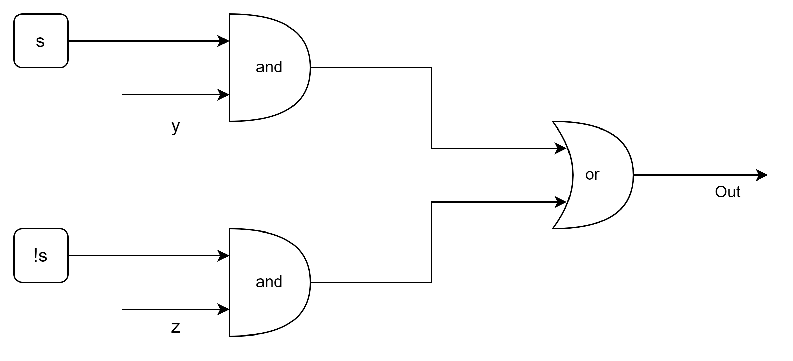

# Datalab

> Datalab requires us to implement simple logical, two's complement, and floating point functions, but using a highly restricted subset of C. For example, they might be asked to compute the absolute value of a number using only bit-level operations and straightline code. This lab helps us understand the bit-level representations of C data types and the bit-level behavior of the operations on data.

注：在 [CSAPP 官网](https://csapp.cs.cmu.edu/3e/labs.html) 中，可以下载所有不含具体答案的 CSAPP 实验。

本文档包含两个部分：

1. Introduction 部分介绍了 Datalab 的细节，包括编码风格、编码规则等内容，该部分内容由 Datalab 的实验手册中直接复制。
2. Solutions 部分具体分析了每个函数的实现思路，并给出具体的实现代码。

## Introduction

The following table lists the puzzles in rought order of difficulty **_from easiest to hardest_**. The "Rating" field gives the difficulty rating (the number of _points_) for the puzzle, and the "Max ops" field gives the **_maximum_** number of operators we are allowed to use to implement each function.
| Name | Description | Rating | Max ops |
| ---- | ----------- | ------ | ------- |
| bitXor(x, y) | x ^ y using only & and ~. | 1 | 14 |
| tmin() | Smallest two’s complement integer | 1 | 4 |
| isTmax(x) | True only if x x is largest two’s comp. integer. | 1 | 10 |
| allOddBits(x) | True only if all odd-numbered bits in x set to 1. | 2 | 12 |
| negate(x) | Return -x with using - operator. | 2 | 5 |
| isAsciDigit(x) | True if 0x30 <= x <= 0x39. | 3 | 15 |
| conditional | Same as x ? y : z | 3 | 16 |
| isLessOrEqual(x, y) | True if x <= y, false otherwise | 3 | 24 |
| logicalNeg(x) | Compute !x without using ! operator. | 4 | 12 |
| howManyBits(x) | Min. no. of bits to represent x in two’s comp. | 4 | 90 |
| floatScale2(uf) | Return bit-level equiv. of 2\*f for f.p. arg. f. | 4 | 30 |
| floatFloat2Int(uf) | Return bit-level equiv. of (int)f for f.p. arg. f. | 4 | 30 |
| floatPower2(x) | Return bit-level equiv. of 2.0ˆx for integer x. | 4 | 30 |

For the floating-point puzzles, we will implement some common **_single-precision_** floating-point operations. For these puzzles, we are allowed to use standard control structures (conditionals, loops), and we may use both `int` and `unsigned` data types, including arbitrary unsigned and integer constants.

we may not use any unions, structs, or arrays. Most significantly, we may not use any floating point data types, operations, or constants. Instead, any floating-point operand will be passed to the function as having type `unsigned`, and any returned floating-point value will be of type `unsigned`. Our code should perform the bit manipulations that implement the specified floating point operations.

### Coding rules

#### Integer Coding rules

Replace the "return" statement in each function with one or more lines of C code that implements the function. Our code must conform to the following style:

```c
int Funct(arg1, arg2, ...) {
    /* brief description of how our implementation works */
    int var1 = Expr1;
    ...
    int varM = ExprM;

    varJ = ExprJ;
    ...
    varN = ExprN;
    return ExprR;
}
```

Each "Expr" is an expression using **_ONLY_** the following:

1. Integer constants 0 through 255 (0xFF), inclusive. We are not allowed to use big constants such as 0xffffffff.
2. Function arguments and local variables (no global variables).
3. Unary integer operations ! ~
4. Binary integer operations & ^ | + << >>

Some of the problems restrict the set of allowed operators even further.Each "Expr" may consist of multiple operators. We are not restricted to one operator per line.

We are expressly **_forbidden_** to:

1. Use any control constructs such as if, do, while, for, switch, etc.
2. Define or use any macros.
3. Define any additional functions in this file.
4. Call any functions.
5. Use any other operations, such as &&, ||, -, or ?:
6. Use any form of casting.
7. Use any data type other than int. This implies that we cannot use arrays, structs, or unions.

We may assume that our machine:

1. Uses tow's complement, 32-bit representations of integers.
2. Performs right shifts arithmetically.
3. Has unpredictable behavior when shifting if the shift amount is less than 0 or greater than 31.

**_EXAMPLES OF ACCEPTABLE CODING STYLE_**:

```c
/*
* pow2plus1 - returns 2^x + 1, where 0 <= x <= 31
*/
int pow2plus1(int x) {
    /* exploit ability of shifts to compute powers of 2 */
    return (1 << x) + 1;
}

/*
* pow2plus4 - returns 2^x + 4, where 0 <= x <= 31
*/
int pow2plus4(int x) {
    /* exploit ability of shifts to compute powers of 2 */
    int result = (1 << x);
    result += 4;
    return result;
}
```

#### Floating point Coding rules

For the problems that require we to implement floating-point operations, the coding rules are **_less strict_**. We are allowed to use looping and
conditional control. We are allowed to use both ints and unsigneds. We can use arbitrary integer and unsigned constants. We can use any arithmetic, logical, or comparison operations on int or unsigned data.

We are expressly **_forbidden_** to:

1. Define or use any macros.
2. Define any additional functions in this file.
3. Call any functions.
4. Use any form of casting.
5. Use any data type other than int or unsigned. This means that we
   cannot use arrays, structs, or unions.
6. Use any floating point data types, operations, or constants.

**_NOTES_**:

1. Use the dlc (data lab checker) compiler (described in the handout) to check the legality of our solutions.
2. Each function has a maximum number of operations (integer, logical, or comparison) that we are allowed to use for Our implementation of the function. The max operator count is checked by dlc. Note that assignment ('=') is not counted; we may use as many of these as we want without penalty.
3. Use the btest test harness to check our functions for correctness.
4. Use the BDD checker to formally verify our functions
5. The maximum number of ops for each function is given in the header comment for each function. If there are any inconsistencies between the maximum ops in the writeup and in this file, consider this file the authoritative source.

## Solutions⭐

### bitXor

bitXor 要求我们通过 `~` 和 `&` 运算符实现 **_XOR_** 运算符，因为 `x ^ y` 等价于 `(~x & y) | (~y & x)`，然而题目中不可以使用 `|` 运算符，可利用**_德摩根律_**（De Morgan Law）将 `|` 运算符仅用 `~` 和 `&` 运算符表示，因此 `x ^ y` 等价于 `~(~(~x & y) & ~(~y & x))`。

```c
/*
 * bitXor - x^y using only ~ and &
 *   Example: bitXor(4, 5) = 1
 *   Legal ops: ~ &
 *   Max ops: 14
 *   Rating: 1
 */
int bitXor(int x, int y) {
  return ~(~(~x & y) & ~(~y & x));
}
```

### tmin

最小的二进制补码整数的值（TMin32）为 `0x80000000`，可以通过左移运算 `1 << 31` 生成 TMin32。

```c
/*
 * tmin - return minimum two's complement integer
 *   Legal ops: ! ~ & ^ | + << >>
 *   Max ops: 4
 *   Rating: 1
 */
int tmin(void) {
  return 1 << 31;
}
```

### isTmax

最大的二进制补码数（TMax32）的值为 `0x7FFFFFFF`，根据位级整数的运算性质，TMax32 + 1（正溢出）等于 TMin32，由于 **~TMin32 等于 TMax32**，进行相等性判断就可判断 `x` 是否为 TMax32。

**注**：`~(x + 1) == x` 共有两种情况，`x` 为 -1 或者 TMax32，因此需要排除 `x` 为 -1 的情况。

```c
/*
 * isTmax - returns 1 if x is the maximum, two's complement number,
 *     and 0 otherwise
 *   Legal ops: ! ~ & ^ | +
 *   Max ops: 10
 *   Rating: 1
 */
int isTmax(int x) {
  int y = x + 1;
  return !(~y ^ x) & !!y;
}
```

### allOddBits

allOddBits 要求我们判断输入 `x` 的所有奇数位是否为 1，可以生成一个掩码 `mask=0xAAAAAAAA`（奇数位全 1，偶数位全 0），通过 `mask & x` 消除 `x` 偶数位的影响，再通过 `!(x ^ y)` 来进行相等性的判断。

```c
/*
 * allOddBits - return 1 if all odd-numbered bits in word set to 1
 *   where bits are numbered from 0 (least significant) to 31 (most significant)
 *   Examples allOddBits(0xFFFFFFFD) = 0, allOddBits(0xAAAAAAAA) = 1
 *   Legal ops: ! ~ & ^ | + << >>
 *   Max ops: 12
 *   Rating: 2
 */
int allOddBits(int x) {
  // 生成掩码 0xAAAAAAAA
  int mask = (0xAA << 24) | (0xAA << 16) | (0xAA << 8) | 0xAA;
  return !((mask & x) ^ mask);
}
```

### negate

可以通过 `~` 和 `+` 运算符实现相反数运算，根据位级整数的性质，`-x` 等价于 `~x + 1`。

```c
/*
 * negate - return -x
 *   Example: negate(1) = -1.
 *   Legal ops: ! ~ & ^ | + << >>
 *   Max ops: 5
 *   Rating: 2
 */
int negate(int x) {
  return ~x + 1;
}
```

### isAsciiDigit

isAsciiDigit 要求我们判断输入 `x` 是否为一个数字字符（`'0' <= x <= '9'`），对应的 ASCII 码范围是 `0x30-0x39`，具有相似的位模式 `0x3.`，大致思路如下：

1. 判断 `x` 是否具有位模式 `0x3.`
2. 在（1）的基础上，判断 `x` 是否小于 0x39。

**注**：判断 `x` 小于 0x39 可以通过 `!(((x + 6) & ~0xF) ^ 0x30)` 进行判断，因为如果 `0x39 < x <= 0x3F` ，则 `(x + 6)` 就不再具有位模式 `0x3.` 了。

```c
/*
 * isAsciiDigit - return 1 if 0x30 <= x <= 0x39 (ASCII codes for characters '0' to '9')
 *   Example: isAsciiDigit(0x35) = 1.
 *            isAsciiDigit(0x3a) = 0.
 *            isAsciiDigit(0x05) = 0.
 *   Legal ops: ! ~ & ^ | + << >>
 *   Max ops: 15
 *   Rating: 3
 */
int isAsciiDigit(int x) {
  return !((x & ~0xF) ^ 0x30) & !(((x + 6) & ~0xF) ^ 0x30);
}
```

### conditional

conditional 要求我们实现一个三目运算符，根据 `x` 的值选择输出 `y` 或 `z`，类似于多路复用器（Multiplexer），多路复用器的作用就是控制信号 `s` 来决定输出哪一个值（`y` 或 `z`），多路复用器的结构如下图所示：



我们可以先根据 `x` 的值，通过表达式 `~((!x << 31) >> 31)` 生成一个掩码 `mask`，计算的过程如下表所示：
| `x` | `!x` | `(!x << 31) >> 31` | `~((!x << 31) >> 31)` |
| --- | --- | --- | --- |
| 0 | 1 | 0xFFFFFFFF | 0 |
| 其他 | 0 | 0 | 0xFFFFFFFF |

`mask` 等于 0 当且仅当 `x` 的值为 0，因此我们将位级的多路复用器推广到字级，表达式 `(mask & y) | (~mask & z)` 即可实现三目运算符。

```c
/*
 * conditional - same as x ? y : z
 *   Example: conditional(2,4,5) = 4
 *   Legal ops: ! ~ & ^ | + << >>
 *   Max ops: 16
 *   Rating: 3
 */
int conditional(int x, int y, int z) {
  int mask = ~((!x << 31) >> 31);
  return (mask & y) | (~mask & z);
}
```

### isLessOrEqual

isLessOrEqual 要求我们实现小于等于号，大致的思路为：计算 `z = x - y`，判断 `z` 的符号。由于异号整数的减法可能会出现溢出问题（overflow），分类讨论：
| Case | Expr | Result |
| --- | --- | --- |
| x < 0 , y > 0 | `sx & !sy` | True |
| x 与 y 同号 | `x - y > 0` | True |
| x > 0, y < 0 | - | False |

我们只需要考虑结果可能为 True 的情况，并利用对应的表达式进行判断。

```c
/*
 * isLessOrEqual - if x <= y  then return 1, else return 0
 *   Example: isLessOrEqual(4,5) = 1.
 *   Legal ops: ! ~ & ^ | + << >>
 *   Max ops: 24
 *   Rating: 3
 */
int isLessOrEqual(int x, int y) {
  // 获取 x、y 的符号位
  int sx = (x >> 31) & 1;
  int sy = (y >> 31) & 1;
  // 计算 x - y
  int z = x + ~y + 1;
  int lessFlag = (sx & !sy) | (!(sx ^ sy) & ((z >> 31) & 1));
  int equalFlag = !z;

  return lessFlag | equalFlag;
}
```

### logicalNeg

logicalNeg 要求我们实现 `!` 运算符（逻辑非），`!x` 结果为 1 当且仅当 `x` 为 0。因此我们只需要判断输入 `x` 是否为 0 即可。`-x` 与 `x` 相等共有以下两种情况：

1. `x` 为 0
2. `x` 为 TMin32

因此我们只需要将情况 2 排除即可，直接通过符号位的判断，具体来说就是当 `x` 和 `-x` 的符号位相同且为 0（排除情况 2）时， x = 0。

```c
/*
 * logicalNeg - implement the ! operator, using all of
 *              the legal operators except !
 *   Examples: logicalNeg(3) = 0, logicalNeg(0) = 1
 *   Legal ops: ~ & ^ | + << >>
 *   Max ops: 12
 *   Rating: 4
 */
int logicalNeg(int x) {
  // 计算 -x
  int y = ~x + 1;
  return ((~x & ~y) >> 31) & 1;
}
```

### howManyBits

howManyBits 要求我们计算出能精确表示 `x` 的最小位数，这里涉及到截断（Truncate）问题，记 $x=(x_{31}, x_{30},\dots, x_0)$，若截断高位，保留低 n 位，截断后的值记为 $x^{\prime}=(x_{n-1}, x_{n-2}, \dots,x_0)$，当且仅当 $x_{31}=x_{30}=\cdots=x_{n-1}$ 时，$x=x^\prime$。

howManyBits 就是要我们找到使得 $x=x^\prime$ 成立的最小 n 值。显然我们可以通过判断 `(x << n) >> n` 与 `x` 是否相等来判断 $x=x^\prime$。最简单的方式就是使用循环找到最小的 n，但根据整数编码规则，我们不可以使用任何控制结构。因此我们可以利用**二分查找**的思想编写顺序代码，减少运算符的使用次数。

```c
/* howManyBits - return the minimum number of bits required to represent x in
 *             two's complem)ent
 *  Examples: howManyBits(12) = 5
 *            howManyBits(298) = 10
 *            howManyBits(-5) = 4
 *            howManyBits(0)  = 1
 *            howManyBits(-1) = 1
 *            howManyBits(0x80000000 = 32
 *  Legal ops: ! ~ & ^ | + << >>
 *  Max ops: 90
 *  Rating: 4
 */
int howManyBits(int x) {
  int flag16 = 0;
  int flag8 = 0;
  int flag4 = 0;
  int flag2 = 0;
  int flag1 = 0;
  int y;

  // flag16 为 1 表示 x 可由 16 bit 进行表示
  y = (x << 16) >> 16;
  flag16 = !(x ^ y);
  x <<= (flag16 << 4);

  y = (x << 8) >> 8;
  flag8 = !(x ^ y);
  x <<= (flag8 << 3);

  y = (x << 4) >> 4;
  flag4 = !(x ^ y);
  x <<= (flag4 << 2);

  y = (x << 2) >> 2;
  flag2 = !(x ^ y);
  x <<= (flag2 << 1);

  y = (x << 1) >> 1;
  flag1 = !(x ^ y);

  return 32 + ~((flag16 << 4) + (flag8 << 3) + (flag4 << 2) + (flag2 << 1) + flag1) + 1;
}
```

### floatScale2

floatScale2 要求我们实现 `2 * f`，其输入为浮点数 `f` 的位级表示 `uf`，大致的思路为：**若 `f` 为规格化数，则将阶码 exp 加 1；若 `f` 为非规格化数，则将 `frac` 左移 1 位**。

对于 IEEE754 浮点数，其值的计算公式为：

$$
V=(-1)^s\times M\times 2^{E}
$$

对于规格化数，$E=exp-bias$，对于非规格化数，$E=1-bias$。

根据阶码 exp 的值，IEEE754 浮点数分为以下 3 类：

1. **规格化数**，0 < exp < 255。
2. **非规格化数**，exp = 0。
3. **特殊值**，exp=255。
   - _Infinity_ (frac = 0)。
   - _NaN_

对于情况 3，直接返回输入参数 `uf` 即可，而对于情况 1 和情况 2，则需要进行一些特殊判断以及处理，因为 `2 * f` 的结果可能会改变浮点数的类型：

- 若 exp = 254，则 `2 * f` 会溢出为 _Infnity_。
- 若 exp = 0，且 `2 * frac` 超过了 frac 的 23 位表示范围。

注：上述两种特殊情况，实际上都是 `2 * f` 溢出改变了 `f` 的类型。

```c
/*
 * floatScale2 - Return bit-level equivalent of expression 2*f for
 *   floating point argument f.
 *   Both the argument and result are passed as unsigned int's, but
 *   they are to be interpreted as the bit-level representation of
 *   single-precision floating point values.
 *   When argument is NaN, return argument
 *   Legal ops: Any integer/unsigned operations incl. ||, &&. also if, while
 *   Max ops: 30
 *   Rating: 4
 */
unsigned floatScale2(unsigned uf) {
  // 获取符号、阶码、尾数
  int s = uf >> 31;
  int exp = (uf >> 23) & 0xFF;
  int frac = uf & 0x7FFFFF;

  // exp 为 255 说明 uf 表示的浮点数 f 为 NaN 或者 Infinity，直接返回 uf
  if (exp == 255)
    return uf;

  if (0 < exp && exp < 254)
  {
    // normal case, 2 * f 为规格化数
    exp += 1;
  }
  else if (exp == 0)
  {
    frac <<= 1;
    if (frac > 0x7FFFFF)
    {
      // 2 * f 变为规格化数
      exp = 1;
      frac &= 0x7FFFFF;
    }
  }
  else if (exp == 254)
  {
    // 2 * f => Infinity
    exp = 255;
    frac = 0;
  }

  return (s << 31) | (exp << 23) | frac;
}
```

### floatFloat2Int

floatFloat2Int 要求我们实现强制类型转换：`(int)f`，单精度浮点数转换为二进制补码整数时可能会出现**溢出**（Overflow）或者**精度损失**的问题。

对于 IEEE754 浮点数，其值的计算公式为：

$$
V=(-1)^s\times M\times 2^{E}
$$

对于规格化数，$E=exp-bias$、$M=1.f$，对于非规格化数，$E=1-bias$、$M=0.f$。分类讨论：

1. 当 exp = 0 时，f 为非规格化数，`(int) f` 结果会舍入到 0。
2. 当 0 < exp < bias 时，f 为规格化数，但 E = exp - bias < 0，`(int) f` 结果会舍入到 0。
3. 当 exp = bias 时，若 frac 最高位为 1，则 result = 2（**向偶数舍入**），否则 result = 1。
4. 若 0 < exp - bias <= 23，则 `(int)f` 结果为 `((1 << 23) | frac) >> (23 - (exp - bias))`。
5. 24 <= exp - bias < 32，则 `(int)f` 结果为 `((1 << 23) | frac) << (exp - bias - 24)`。
6. 否则，exp - bias >= 32，则 `(int)f` 发生溢出。

注：exp - bias 与 23 进行比较的原因是 `((1 << 23) | frac)` 决定左移还是右移：

- 若 exp - bias <= 23，则右移 `23 - (exp - bias)` 位。
- 若 23 < exp - bias < 32，则左移 `exp - bias - 24` 位。

```c
/*
 * floatFloat2Int - Return bit-level equivalent of expression (int) f
 *   for floating point argument f.
 *   Argument is passed as unsigned int, but
 *   it is to be interpreted as the bit-level representation of a
 *   single-precision floating point value.
 *   Anything out of range (including NaN and infinity) should return
 *   0x80000000u.
 *   Legal ops: Any integer/unsigned operations incl. ||, &&. also if, while
 *   Max ops: 30
 *   Rating: 4
 */
int floatFloat2Int(unsigned uf)
{
  int bias = 127;
  // 获取符号、阶码、尾数
  int s = uf >> 31;
  int exp = (uf >> 23) & 0xFF;
  int frac = uf & 0x7FFFFF;
  int result = 0;
  // 非规格化数 (int)f => 0. OR 规格化数 E=exp-bias < 0, (int)f => 0
  if (exp < bias)
    return 0;
  else if (exp - bias <= 23)
    result = ((1 << 23) | frac) >> (23 - (exp - bias));
  else if (exp - bias < 32)
    result = ((1 << 23) | frac) << (exp - bias - 24);
  // NaN、Infinity or Overflow.
  else if (exp == 255 || exp - bias >= 32)
    return 0x80000000u;

  return s ? -result : result;
}

```

### floatPower2

floatPower2 要求我们计算 $2^x$，对于 IEEE754 单精度浮点数来说，其表示的范围是有限的，$2^x$ 的范围是 $2^{k}$，其中 $k\in \mathbb{Z}$ 且：

- 对于规格化数，$ -126\le k\le 127$。
- 对于非规格化数，$-149\le k \le -127$。

对于规格化数（0 < exp < 255），其值的计算方式为：

$$
V=(-1)^s\times 1.f\times 2^{(exp - bias)}
$$

尾数 f = 0 的规格化数可以表示 $2^x$，最小值对应的 exp = 1，最大值对应的 exp = 254。

对于非规格化数（exp=0），其值的计算方式为：

$$
V=(-1)^s\times 0.f \times 2^{1-bias}
$$

尾数 f 中有一个比特为 1 的非规格化数也可以表示 $2^x$，最小值对应的 f = 1，最大值对应的 f = 0x400000。

```c
/*
 * floatPower2 - Return bit-level equivalent of the expression 2.0^x
 *   (2.0 raised to the power x) for any 32-bit integer x.
 *
 *   The unsigned value that is returned should have the identical bit
 *   representation as the single-precision floating-point number 2.0^x.
 *   If the result is too small to be represented as a denorm, return
 *   0. If too large, return +INF.
 *
 *   Legal ops: Any integer/unsigned operations incl. ||, &&. Also if, while
 *   Max ops: 30
 *   Rating: 4
 */
unsigned floatPower2(int x)
{
  unsigned result = 0;

  // 2.0^x => +Infinity
  if (x > 127)
    return 0x7F800000u;
  else if (x < -149)
    return 0u;
  else if (-149 <= x && x <= -127)
  {
    result = 1 << (x + 149);
  }
  else // -126 <= x <= 127
  {
    result = (x + 127) << 23;
  }

  return result;
}
```

## Evaluation

运行以下指令，对 bits.c 进行编译和**正确性测试**：

```bash
make
./btest
```

可得到如下结果：

```
Score   Rating  Errors  Function
 1      1       0       bitXor
 1      1       0       tmin
 1      1       0       isTmax
 2      2       0       allOddBits
 2      2       0       negate
 3      3       0       isAsciiDigit
 3      3       0       conditional
 3      3       0       isLessOrEqual
 4      4       0       logicalNeg
 4      4       0       howManyBits
 4      4       0       floatScale2
 4      4       0       floatFloat2Int
 4      4       0       floatPower2
Total points: 36/36
```

运行以下指令，验证编码的**合法性**：

```bash
./dlc bits.c
```

不输出任何错误信息，说明每一个问题均符合题目要求。

运行以下指令，进行**性能测试**：

```bash
./driver.pl
```

得到如下结果：

```
Correctness Results     Perf Results
Points  Rating  Errors  Points  Ops     Puzzle
1       1       0       2       8       bitXor
1       1       0       2       1       tmin
1       1       0       2       7       isTmax
2       2       0       2       9       allOddBits
2       2       0       2       2       negate
3       3       0       2       10      isAsciiDigit
3       3       0       2       8       conditional
3       3       0       2       17      isLessOrEqual
4       4       0       2       7       logicalNeg
4       4       0       2       39      howManyBits
4       4       0       2       18      floatScale2
4       4       0       2       24      floatFloat2Int
4       4       0       2       12      floatPower2

Score = 62/62 [36/36 Corr + 26/26 Perf] (162 total operators)
```

可以看到我们编码的正确性分数和性能分数是满分的。
